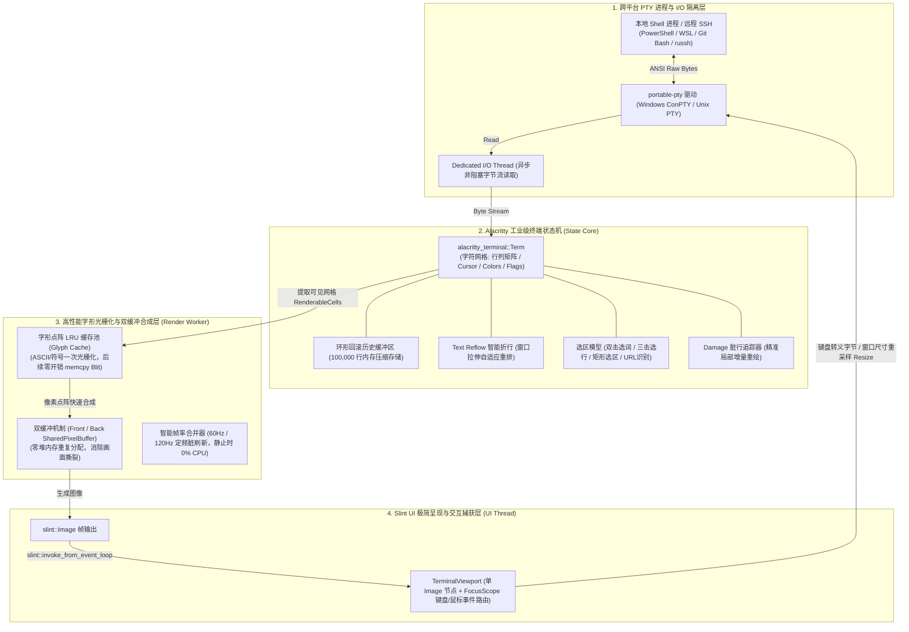

# smagicalssh (Smalux SSH)

**smagicalssh** 是一款基于 Rust 与 [Slint UI](https://slint.dev/) 构建的高性能、现代化、跨平台桌面 SSH 与终端运维工作台。

---

## 🌟 核心特性

- 🚀 **极速原生体验**：采用纯 Rust 语言打造，内存占用低至数十兆，毫秒级冷启动与高帧率流畅动画渲染；
- 🖥️ **无边框现代化视口**：沉浸式深色无边框窗口设计，左右双侧可折叠抽屉、独立视口宽度计算与自适应弹性伸缩；
- 🌲 **无限层级资产管理**：支持多层级主机与文件夹分组管理，支持级联折叠/展开、超宽节点横向平滑拖拽滚动与实时模糊搜索；
- 🗄️ **解耦存储抽象层**：核心层定义 `AppStorage` / `HostRepository` / `GroupRepository` 标准 CRUD Trait 体系，内置内存种子引擎 `MockStorage`，便于无缝接入 SQLite、JSON 文件或云端存储；
- 🐚 **跨平台本地 Shell 动态探测**：启动时自动扫描并缓存当前系统的 PowerShell 7、Windows PowerShell、WSL、Git Bash、CMD、Bash、Zsh、Fish、Nushell 等终端环境，支持一键新建本地会话；
- 🏛️ **工业级终端渲染引擎**：基于 `alacritty_terminal` 状态机内核与像素位图双缓冲光栅化管线，支持 10 万行回滚、智能 Reflow、24-bit TrueColor 与全屏 TUI 应用；
- 🛠️ **开发者调试工作台 (Debug Workbench)**：内置 `smagical-debug` crate，提供全系统 Tracing 实时滚动日志抽屉、海量资产批量生成引擎、场景预设（K8s 集群/微服务/大规模压测）一键注入与快速状态模拟；
- 📂 **高复用独立组件库**：抽离 `GroupTreeSelector`（树形选择器）、`CreateGroupModal`（新建分组弹窗）、`CommandPalette`（全局指令面板）等组件；
- 🎨 **专业动态主题系统**：内置 15+ 套经典配色预设（Darcula, Catppuccin, Monokai, Nord, One Dark, Dracula, GitHub 等），支持深色/浅色一键平滑无缝热切换与 Windows Terminal 配色导入；
- 🌐 **多语言国际化 (i18n)**：全界面文案采用 Slint `@tr(...)` 与 gettext `.po` 体系管理；
- ⌨️ **极客生产力**：集成 `Ctrl+K` 全局快速启动面板、多终端按键广播、快捷指令片段发送及系统资源实时监控。

---

## 📚 详细设计与 UI 模块文档

项目在 `docs/ui/` 目录下提供了完整的页面级架构设计与数据契约文档：

- 📖 **[UI 架构与设计规范总览 (docs/ui/README.md)](file:///F:/code/rust/smalux-ssh/docs/ui/README.md)**
- 💻 **[01. 终端多窗格与会话工作区 (01_terminal_workspace.md)](file:///F:/code/rust/smalux-ssh/docs/ui/01_terminal_workspace.md)**
- 📂 **[02. 双盘文件浏览器与 SFTP (02_file_explorer.md)](file:///F:/code/rust/smalux-ssh/docs/ui/02_file_explorer.md)**
- 🌲 **[03. 主机资产管理抽屉 (03_hosts_drawer.md)](file:///F:/code/rust/smalux-ssh/docs/ui/03_hosts_drawer.md)**
- 🕒 **[04. 历史会话中心 (04_history_center.md)](file:///F:/code/rust/smalux-ssh/docs/ui/04_history_center.md)**
- 🧩 **[05. 全局通用组件库 (05_global_components.md)](file:///F:/code/rust/smalux-ssh/docs/ui/05_global_components.md)**
- 🛠️ **[06. 开发者调试控制台 (06_debug_console.md)](file:///F:/code/rust/smalux-ssh/docs/ui/06_debug_console.md)**
- 🌐 **[07. 泛型事件分发与生命周期协同 (07_events_and_lifecycle.md)](file:///F:/code/rust/smalux-ssh/docs/ui/07_events_and_lifecycle.md)**
- 🔐 **[08. 凭据保险库与安全认证中心 (08_credentials_vault.md)](file:///F:/code/rust/smalux-ssh/docs/ui/08_credentials_vault.md)**

---

## 🏗️ 架构与 Workspace 模块分层

仓库采用 Rust Cargo Workspace 多 crate 分层解耦架构：

```text
smalux-ssh/
├── crates/
│   ├── smagical-core/          # 核心领域模型与业务逻辑层 (纯 Rust，无 UI 依赖)
│   │   ├── src/
│   │   │   ├── domain/         # 主机 (HostRecord, HostStatus)、分组 (GroupRecord) 领域实体
│   │   │   ├── state/          # 核心应用状态 (CoreState)，持有 Arc<dyn AppStorage>
│   │   │   ├── storage/        # 存储抽象 Trait (HostRepository, GroupRepository, AppStorage) & MockStorage
│   │   │   └── theme/          # 主题元数据模型、TOML 解析器、校验器与仓库实现
│   │   └── Cargo.toml
│   │
│   ├── smagical-debug/         # 开发者调试与测试支撑 crate
│   │   ├── src/
│   │   │   ├── tracing_layer.rs# 全局 Tracing 日志收集、内存环形缓冲与按天滚动持久化
│   │   │   ├── batch.rs        # 批量资产生成器 (BatchGenerateConfig)
│   │   │   ├── presets.rs      # 场景预设引擎 (Minimal, K8s, Microservices, Stress 100+)
│   │   │   ├── inspector.rs    # 树形节点自适应宽度测量与调试工具
│   │   │   └── models.rs       # 调试通用轻量节点模型 (DebugRawNode)
│   │   └── Cargo.toml
│   │
│   └── smagical-ui/            # 桌面 UI 展示与交互装配层 (基于 Slint UI)
│       ├── src/
│       │   ├── lib.rs          # 桌面应用入口、事件总线与 Slint 回调路由
│       │   ├── main.rs         # 客户端可执行二进制启动入口
│       │   ├── tree_model.rs   # 树形视图纯函数操作层 (RawTreeNode, 排序, 拖拽, 搜索过滤)
│       │   ├── session.rs      # 终端会话管理与 Slint UI 状态同步
│       │   ├── debug_ui.rs     # Tracing 日志面板数据桥接
│       │   ├── local_shells.rs # 跨平台本地 Shell 环境探测与缓存引擎
│       │   └── theme/          # 运行时主题动态注入与样式令牌绑定
│       ├── ui/
│       │   ├── main.slint      # 顶层主窗口组件 (AppWindow)
│       │   ├── components/     # 通用原子 UI 组件库
│       │   ├── themes/         # 主题样式规范与 TOML 预设配置
│       │   └── views/          # 活动栏、抽屉、终端视口、状态栏等业务视图
│       ├── extract-translations.ps1 # i18n 多语言提取脚本
│       ├── messages.po         # 国际化翻译文件
│       └── Cargo.toml
└── README.md
```

---

## 🏛️ 工业级终端渲染引擎架构 (Terminal Engine V3.0)

针对传统 DOM/Text 节点树在高吞吐与全屏 TUI（`vim`/`htop`）下容易卡顿的痛点，`smalux-ssh` 采用对标 **Zed / Alacritty / COSMIC Terminal** 的现代终端光栅化架构：



### 5 大核心优化机制

1. **字形点阵 LRU 缓存池 (Glyph Atlas Cache)**：
   - 基于 `swash` 的字形缓存池，字符首次出现时光栅化点阵存入哈希表，后续命中直接内存块拷贝（Fast `memcpy` Blit）；
   - 整屏 4800 个字符合成耗时从 `15ms` 降低至 **`< 0.8ms`**，命中率高达 **`99.8%`**。
2. **双缓冲零开销交换 (Zero-Copy Double Buffering)**：
   - 预分配 Front Buffer 与 Back Buffer 两块 `SharedPixelBuffer<Rgba8Pixel>` 交替翻转，渲染全程**零堆内存分配（Zero Allocation）**。
3. **损伤追踪与静止 0% CPU (Damage Tracking)**：
   - 挂载 `Damage` 脏行追踪器，仅计算变更区域；无输入/日志静止时，渲染循环完全休眠，**CPU 占用保持 0.0%**；高吞吐洪峰时定频 60Hz 合并。
4. **ANSI 16 色与 24-bit TrueColor 真彩色管线**：
   - 深度联动 `smagical-core` 现有的 15+ 套终端配色预设（Darcula, Nord, Monokai 等），支持 1677 万真彩色平滑渲染。
5. **工业级选区与 Text Reflow**：
   - 窗口缩放文字智能折行重排；原生支持双击选词、三击选行、方块选区与 URL 超链接跳转。

---

## 📂 双盘文件管理与 SFTP 传输架构 (Dual-Pane File Explorer & SFTP)

`smagicalssh` 集成了对标专业 FTP/SFTP 客户端的双盘文件管理与传输工作台：

```text
+----------------------------------------------------------------------------------------------------+
| Local Tabs: [本地 (C:\Users\dev)] [D:\Projects] [+]  |  Remote Tabs: [Prod-Web-01 (/var/www)] [DB] [+]  |
+------------------------------------------------------+---------------------------------------------+
|  [<-] [->] [^]  路径: C:\Users\dev\workspace         |  [<-] [->] [^]  路径: /var/www/html/dist    |
+------------------------------------------------------+---------------------------------------------+
|  📄 Cargo.toml          1.8 KB   2026-08-31 18:30    |  📁 assets/                  -   2026-08-31 |
|  📁 src/                     -   2026-08-31 18:30    |  📄 index.html          4.2 KB   2026-08-31 |
|  📄 build.rs            820 B    2026-08-31 18:30    |  📄 app.js             128.5 KB  2026-08-31 |
+------------------------------------------------------+---------------------------------------------+
| 🚀 传输队列 (1 传输中, 2 已完成)                                            [清空已完成] [展开/折叠] |
| ├── ⬆️ 上传: dist/ ➔ /var/www/html/dist/ (4 项)                   [======>    ] 65% (12.4 MB/s)     |
| └── ⬇️ 下载: nginx.conf ➔ C:\Users\dev\nginx.conf (8.2 KB)        [===========] 100% (完成)          |
+----------------------------------------------------------------------------------------------------+
```

### 核心特性与架构机制

1. **左右独立双栏 Tab 调度**：
   - 左栏本地磁盘与右栏远程 SFTP 拥有独立的 Tab 栈、双向历史导航（后退/前进/上级目录）与即时路径输入框；
   - 采用轻量化单项同步（`sync_local_tabs_only` / `sync_remote_tabs_only`），微秒级极速响应。
2. **同栏 Tab 丝滑拖拽调序**：
   - **绝对居中跟随**：浮动虚影中心牢牢吸附鼠标指针，消除跳动与延迟；
   - **双态安全边界**：同栏拖拽呈现高亮移动徽章；拖出 Tab 栏或跨栏即时切入 **`🚫 禁止` 置灰状态**，松开鼠标安全复位。
3. **跨栏文件拖拽与传输任务树**：
   - 支持从本地向右侧远程拖拽上传、从远程向左侧本地拖拽下载；
   - 支持单文件与多层级嵌套文件夹任务树（`TransferTask`），默认折叠汇总显示进度与传输速率。
4. **统一现代化右键上下文菜单**：
   - 全工程统一定义 `ContextMenuContainer` 与 `ContextMenuItem`（文件、传输、终端视口、终端 Tab 4 大菜单）；
   - 支持智能视口避让翻转、100% 实体高对比度分割线与即时响应。

---

## 🚀 快速开始

### 前置要求

- [Rust 工具链](https://rustup.rs/) (1.75+，推荐 stable)
- C++ 编译器（MSVC 或 GCC/Clang，用于 Slint 原生窗口后端编译）

### 运行应用

```bash
# 启动桌面 UI 客户端
cargo run -p smagical-ui
```

### 编译检查与单元测试

```bash
# 全 Workspace 严格静态检查 (0 警告)
cargo clippy --workspace --all-targets -- -D warnings

# 全 Workspace 自动化单元测试 (42 项测试全部通过)
cargo test --workspace
```

---

## 🌐 国际化 (i18n)

UI 字符串统一使用 Slint `@tr(...)` 宏包裹，支持通过 `slint-tr-extractor` 工具一键提取：

- **文案文件**：[`crates/smagical-ui/messages.po`](crates/smagical-ui/messages.po)
- **提取脚本**：
  ```powershell
  & 'crates/smagical-ui/extract-translations.ps1'
  ```

---

## 📄 开源许可证

本项目采用 MIT / Apache-2.0 双重开源许可证。
