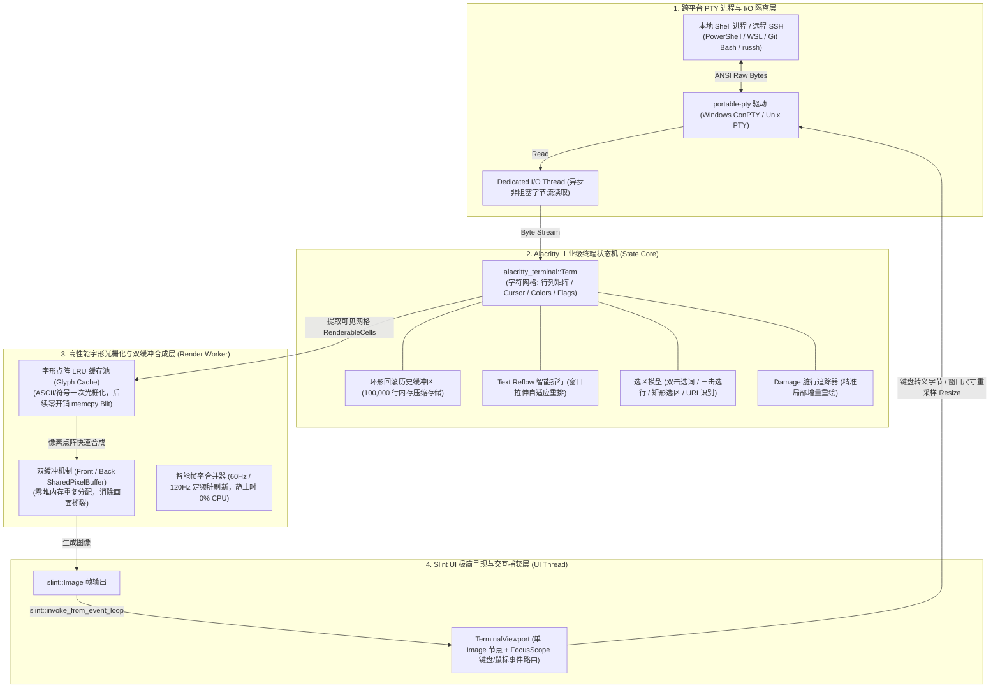

# smagicalssh (Smalux SSH)

**smagicalssh** 是一款基于 Rust 与 [Slint UI](https://slint.dev/) 构建的高性能、现代化、跨平台桌面 SSH 与终端运维工作台。

---

## 🌟 核心特性

- 🚀 **极速原生体验**：采用纯 Rust 语言打造，内存占用低至数十兆，毫秒级冷启动与高帧率流畅动画渲染；
- 🖥️ **无边框现代化视口**：沉浸式深色无边框窗口设计，左右双侧可折叠抽屉、独立视口宽度计算与自适应弹性伸缩；
- 🌲 **无限层级资产管理**：支持多层级主机与文件夹分组管理，支持级联折叠/展开、超宽节点横向平滑拖拽滚动与实时模糊搜索；
- 🗄️ **解耦存储抽象层**：核心层定义 `AppStorage` / `HostRepository` / `GroupRepository` 标准 CRUD Trait 体系，内置内存种子引擎 `MockStorage`，便于无缝接入 SQLite、JSON 文件或云端存储；
- 🐚 **跨平台本地 Shell 动态探测**：启动时自动扫描并缓存当前系统的 PowerShell 7、Windows PowerShell、WSL、Git Bash、CMD、Bash、Zsh、Fish、Nushell 等终端环境，支持一键新建本地会话；
- 🏛️ **工业级终端渲染引擎**：基于 `alacritty_terminal` 状态机内核与像素位图双缓冲光栅化管线，支持 10 万行回滚、智能 Reflow、24-bit TrueColor、智能 URL 识别/手型指针与浏览器直达、字形伽马笔画补强与全屏 TUI 应用；
- 🛠️ **开发者调试工作台 (Debug Workbench)**：内置 `smagical-debug` crate，提供全系统 Tracing 实时滚动日志抽屉、海量资产批量生成引擎、场景预设（K8s 集群/微服务/大规模压测）一键注入与快速状态模拟；
- ⚙️ **全能偏好设置中心 (Settings Center)**：提供常规启动/窗口、外观与壁纸轮播、终端排版 (光标/回滚/CRT滤镜/关键字高亮规则矩阵)、网络代理与超时、多端云同步矩阵 (本地快照/S3/WebDAV/Gist)、主密码安全加解密防护以及快捷键绑定矩阵等 8 大核心维度；
- 🌐 **现代化网络隧道工作台 (Tunnels & Proxy)**：原生集成端口转发（本地/远程/动态 SOCKS5 网关）、多跳跳板机堡垒链路以及静态出网代理节点，支持可视化拓扑连接与实时速率波形监测；
- 🔐 **安全凭据保管库 (Credentials Vault)**：全屏与抽屉双模式管理 SSH 私钥/证书、口令与 Agent 凭据，内置 Ed25519/RSA 密钥生成器与敏感凭据防窥遮蔽；
- 📜 **层级脚本与代码片段中心 (Snippets Center)**：支持多层文件夹嵌套树、参数化模板引擎 `{{key:default}}` 动态表单解析、一键插入终端与后台批量执行；
- 📂 **高复用独立组件库**：抽离 `GroupTreeSelector`（树形选择器）、`CreateGroupModal`（新建分组弹窗）、`CommandPalette`（全局指令面板）等组件；
- 🎨 **专业动态主题系统**：内置 15+ 套经典配色预设（Darcula, Catppuccin, Monokai, Nord, One Dark, Dracula, GitHub 等），支持深色/浅色一键平滑无缝热切换与 Windows Terminal 配色导入；
- 🌐 **多语言国际化 (i18n)**：全界面文案采用 Slint `@tr(...)` 与 gettext `.po` 体系管理；
- ⌨️ **极客生产力**：集成断线原地免密静默重连、SSH 阶段化流式诊断输出、`Ctrl+K` 全局快速启动面板、多终端按键广播、快捷指令片段发送及系统资源实时监控。

---

## 📚 详细设计与 UI 模块文档

项目在 `docs/ui/` 目录下提供了完整的页面级架构设计与数据契约文档：

- 📖 **[UI 架构与设计规范总览 (docs/ui/README.md)](file:///F:/code/rust/smalux-ssh/docs/ui/README.md)**
- 💻 **[01. 终端多窗格与会话工作区 (01_terminal_workspace.md)](file:///F:/code/rust/smalux-ssh/docs/ui/01_terminal_workspace.md)**
- 📂 **[02. 双盘文件浏览器与 SFTP (02_file_explorer.md)](file:///F:/code/rust/smalux-ssh/docs/ui/02_file_explorer.md)**
- 🌲 **[03. 主机资产管理抽屉 (03_hosts_drawer.md)](file:///F:/code/rust/smalux-ssh/docs/ui/03_hosts_drawer.md)**
- 🕒 **[04. 历史会话中心 (04_history_center.md)](file:///F:/code/rust/smalux-ssh/docs/ui/04_history_center.md)**
- 🧩 **[05. 全局通用组件库 (05_global_components.md)](file:///F:/code/rust/smalux-ssh/docs/ui/05_global_components.md)**
- 🛠️ **[06. 开发者调试控制台 (06_debug_console.md)](file:///F:/code/rust/smalux-ssh/docs/ui/06_debug_console.md)**
- 🌐 **[07. 泛型事件分发与生命周期协同 (07_events_and_lifecycle.md)](file:///F:/code/rust/smalux-ssh/docs/ui/07_events_and_lifecycle.md)**
- 🔐 **[08. 凭据保险库与安全认证中心 (08_credentials_vault.md)](file:///F:/code/rust/smalux-ssh/docs/ui/08_credentials_vault.md)**
- 📜 **[09. 代码片段与层级脚本中心 (09_code_snippets.md)](file:///F:/code/rust/smalux-ssh/docs/ui/09_code_snippets.md)**
- ⚙️ **[10. 偏好设置中心与多端云同步矩阵 (10_settings_center.md)](file:///F:/code/rust/smalux-ssh/docs/ui/10_settings_center.md)**
- 🌐 **[11. 网络隧道、跳板机与出网代理 (11_network_tunnels.md)](file:///F:/code/rust/smalux-ssh/docs/ui/11_network_tunnels.md)**
- 🏗️ **[12. 特性内聚与组件模块化重构全景指南 (12_architecture_refactor_guide.md)](file:///F:/code/rust/smalux-ssh/docs/ui/12_architecture_refactor_guide.md)**

---

### 🏗️ 架构与 Workspace 模块分层

仓库采用 Rust Cargo Workspace 多 crate 分层解耦与微前端架构，严格遵循职责分离与纯 Rust 自研原则：

```text
smalux-ssh/
├── crates/
│   ├── smagical-core/          # 核心业务领域实体、状态引擎与仓储/服务契约层 (纯 Rust，无 UI/平台外部工具依赖)
│   │   ├── domain/             # 主机、凭据、分组、隧道、片段、历史、AI 流式客户端、文件、配置等 13 个实体
│   │   ├── event/              # 强类型泛型事件分发总线与全生命周期拦截守护机制 (30+ 领域事件)
│   │   ├── storage/            # 7 大仓储 Trait 契约与 AppStorage 聚合门面 (含保险库生命周期契约)
│   │   ├── service/            # 六边形服务契约 (SshSessionService, SftpService, TunnelService, KeygenService 等)
│   │   ├── state/              # 全局状态中枢 CoreState (统一调度存储热插拔、事件总线、动态路由)
│   │   └── theme/              # 主题领域模型、WCAG 对比度校验与多级继承解析引擎
│   │
│   ├── smagical-ssh/           # 纯 Rust SSH/SFTP 协议协议栈与密钥/监控引擎 (独立跨平台，无宿主外部依赖)
│   │   ├── session_driver.rs   # 纯 Rust 原生 SSH 交互终端与 Exec 通道驱动 (RusshSessionDriver)
│   │   ├── sftp_driver.rs      # 纯 Rust 原生 SFTP 二进制协议客户端驱动 (RusshSftpDriver)
│   │   ├── tunnel_driver.rs    # 纯 Rust 原生网络隧道与端口转发驱动 (RusshTunnelDriver)
│   │   ├── keygen.rs           # 原生 Ed25519 / RSA-4096 / ECDSA SSH 密钥对生成 (NativeKeygenService)
│   │   ├── monitor.rs          # 远程主机 CPU/内存/网络实时指标采集探针 (RusshMetricsDriver)
│   │   ├── known_hosts.rs      # OpenSSH Known Hosts 原生文件管理与主机公钥验真 (TOFU)
│   │   ├── importer.rs         # 原生纯 Rust OpenSSH ~/.ssh/config / Termius / Xshell 导入解析器
│   │   └── ssh_config.rs       # 统一 SSH 连接参数拼装与安全收敛 (SshLaunchConfig)
│   │
│   ├── smagical-storage/       # 数据持久化与存储实现层 (工业级安全保险库 + SQLite 物理数据库 + 仿真 Mock)
│   │   ├── crypto/             # AES-256-GCM + Argon2id 安全保险库 (信封加密、金丝雀校验、敏感内存抹零)
│   │   ├── entities/           # SeaORM 关系型实体映射 (13 张数据表 Schema，含备份策略与快照)
│   │   ├── seaorm/             # 基于 SQLite 的 SeaORM 物理仓储实现 (自动 DDL 建表与数据迁移)
│   │   ├── mock/               # 基于读写锁的高性能并发内存仿真仓储 (预装 6 组 10 主机真实种子数据)
│   │   └── storage_mode.rs     # 跨进程存储模式首选项治理 (~/.config/smalux-ssh/storage_mode.txt)
│   │
│   ├── smalux-cli/             # 纯 Rust 双模（Headless CLI + TUI 交互）资产管理与运维终端
│   │   ├── src/main.rs         # 命令行入口 (支持直接命令执行模式与全屏交互式 TUI 仪表盘)
│   │   ├── src/terminal_session.rs # 基于 russh 的交互式终端会话
│   │   └── src/tui/            # 基于 Ratatui + Crossterm 的终端图形界面
│   │
│   ├── ui/                     # 现代微前端 Slint 组件体系 (解耦编译，消除内存暴涨)
│   │   ├── common/             # 跨插件共享设计系统 (AppTheme, 基础控件, 脚手架与 13 大 Bridge 单例)
│   │   ├── kernel/             # 微内核底座 (唯一 Slint build.rs 构建入口，多窗格视口，活动栏，弹窗)
│   │   └── plugins/            # 8 大页面级独立插件 (与左侧活动栏 8 个图标严格 1:1 对齐)
│   │       ├── hosts/          # [页面 1: 主机资产] (含 companion/ 独立伴生目录: ai/, monitor/, tmux/)
│   │       ├── files/          # [页面 2: 文件管理器] (含 companion/ sftp 传输抽屉)
│   │       ├── snippets/       # [页面 3: 代码片段库] (含 companion/ 快速命令抽屉)
│   │       ├── tunnels/        # [页面 4: 端口隧道拓扑] (含 companion/ 快速控制抽屉)
│   │       ├── credentials/    # [页面 5: 凭据保管箱] (密钥管理、指纹解析、密钥生成)
│   │       ├── history/        # [页面 6: 连接审计历史] (时间流审计、终端快照回溯)
│   │       ├── settings/       # [页面 7: 偏好设置外观] (外观工坊、取色器、全屏设置、备份)
│   │       └── debug/          # [页面 8: 开发者调试台] (状态探针、批量模拟、日志查看器)
│   │
│   └── smagical-ui/            # 桌面客户端业务组装与控制中枢 (终端渲染引擎、Handlers 集群、系统托盘)
│       ├── terminal/           # 纯 Rust 软光栅终端引擎 (ConPTY/OpenPTY, Parser, fontdue CPU 着色, SplitTree)
│       ├── handlers/           # 1:1 领域事件处理器集群 (主机、会话、凭据、隧道、文件、设置、主题)
│       ├── store/              # 树形资产增量 Diff 算法与 UI 状态缓存 (消除界面全量刷新闪烁)
│       ├── theme/              # 运行时主题动态热注入 (无需重启即时平滑换肤)
│       ├── debug/              # Tracing 全局日志环形缓冲区与开发者控制台
│       └── local_shells.rs     # 跨平台本地 Shell 环境探测与启动参数预设
└── README.md
```

---

### 📖 模块独立文档导航 (Module Documentation Matrix)

每个核心 Crate 与 UI 插件均维护有独立的 `README.md`，详细记录其职责定位、调用方式、核心函数与参数契约：

| 模块分类 | 模块路径 | 独立文档链接 | 着力方向与核心职责 |
| :--- | :--- | :--- | :--- |
| **核心领域** | `crates/smagical-core` | [smagical-core 文档](crates/smagical-core/README.md) | 纯 Rust 业务领域模型、强类型事件总线、六边形服务契约与仓储抽象 |
| **网络协议** | `crates/smagical-ssh` | [smagical-ssh 文档](crates/smagical-ssh/README.md) | 纯 Rust 原生 SSH/SFTP/隧道驱动、NativeKeygenService、主机指标监控 |
| **数据持久** | `crates/smagical-storage` | [smagical-storage 文档](crates/smagical-storage/README.md) | SQLite 关系持久化、AES-256-GCM + Argon2id 安全保险库、Mock 内存仓储 |
| **终端命令** | `crates/smalux-cli` | [smalux-cli 文档](crates/smalux-cli/README.md) | 纯 Rust 双模终端（Headless CLI 子命令 + Ratatui 全屏交互式 TUI） |
| **界面总成** | `crates/smagical-ui` | [smagical-ui 文档](crates/smagical-ui/README.md) | 工业级软光栅终端、60Hz 脏渲染、双缓冲、Handlers 处理器集群、系统托盘 |
| **UI 体系** | `crates/ui` | [ui 总览文档](crates/ui/README.md) | Slint 微前端体系总览、单点编译与微内核解耦设计 |
| **UI 设计系统** | `crates/ui/common` | [ui/common 文档](crates/ui/common/README.md) | `AppTheme` 令牌系统、15+ 预设、原子/复合控件与 13 大 Bridge 单例 |
| **UI 编译内核** | `crates/ui/kernel` | [ui/kernel 文档](crates/ui/kernel/README.md) | Slint AOT 唯一编译中心 (`build.rs`)、`AppWindow` 主框架、全向无边框拉伸 |
| **UI 插件总览** | `crates/ui/plugins` | [ui/plugins 文档](crates/ui/plugins/README.md) | 8 大业务插件规范与动态插拔契约 |
| ├─ 资产管理 | `crates/ui/plugins/hosts` | [hosts 插件文档](crates/ui/plugins/hosts/README.md) | 主机树形拓扑、分组管理、AI 伴生助手、Linux 探针与 Tmux 抽屉 |
| ├─ 双盘文件 | `crates/ui/plugins/files` | [files 插件文档](crates/ui/plugins/files/README.md) | 双盘本地/远程浏览器、Tab 历史栈、SFTP 传输抽屉与任务队列面板 |
| ├─ 凭据保险 | `crates/ui/plugins/credentials` | [credentials 插件文档](crates/ui/plugins/credentials/README.md) | 私钥/密码/证书管理、公钥指纹解析、纯 Rust Ed25519/RSA 密钥生成 |
| ├─ 代码片段 | `crates/ui/plugins/snippets` | [snippets 插件文档](crates/ui/plugins/snippets/README.md) | 参数化模板提取 `{{var}}`、快速命令抽屉、终端直接注入执行 |
| ├─ 网络隧道 | `crates/ui/plugins/tunnels` | [tunnels 插件文档](crates/ui/plugins/tunnels/README.md) | 本地/远程转发、动态 SOCKS5 代理、多跳跳板拓扑与流量速率监控 |
| ├─ 偏好设置 | `crates/ui/plugins/settings` | [settings 插件文档](crates/ui/plugins/settings/README.md) | 8 大偏好维度、主题工坊取色器弹窗、数据快照导出导入 |
| ├─ 审计历史 | `crates/ui/plugins/history` | [history 插件文档](crates/ui/plugins/history/README.md) | 会话时间线审计、退出码追踪、终端屏幕历史快照审计弹窗 |
| └─ 调试台 | `crates/ui/plugins/debug` | [debug 插件文档](crates/ui/plugins/debug/README.md) | Tracing 环形滚动日志、海量资产批量生成模拟器、状态探针 |

---

## 🏛️ 工业级终端渲染引擎架构 (Terminal Engine V3.0)

针对传统 DOM/Text 节点树在高吞吐与全屏 TUI（`vim`/`htop`）下容易卡顿的痛点，`smalux-ssh` 采用对标 **Zed / Alacritty / COSMIC Terminal** 的现代终端光栅化架构：


```mermaid
flowchart TD
    subgraph L1["1. 跨平台 PTY 进程与 I/O 隔离层"]
        PTY_Process["本地 Shell 进程 / 远程 SSH<br/>(PowerShell / WSL / Git Bash / russh)"]
        ConPTY["portable-pty 驱动 (Windows ConPTY / Unix PTY)"]
        AsyncReader["Dedicated I/O Thread (异步非阻塞字节流读取)"]
    end

    subgraph L2["2. Alacritty 工业级终端状态机 (State Core)"]
        TermCore["alacritty_terminal::Term<br/>(字符网格: 行列矩阵 / Cursor / Colors / Flags)"]
        Scrollback["环形回滚历史缓冲区 (100,000 行内存压缩存储)"]
        ReflowEngine["Text Reflow 智能折行 (窗口拉伸自适应重排)"]
        SelectionEngine["选区模型 (双击选词 / 三击选行 / 矩形选区 / URL识别)"]
        DamageTracker["Damage 脏行追踪器 (精准局部增量重绘)"]
    end

    subgraph L3["3. 高性能字形光栅化与双缓冲合成层 (Render Worker)"]
        GlyphAtlas["字形点阵 LRU 缓存池 (Glyph Cache)<br/>(ASCII/符号一次光栅化，后续零开销 memcpy Blit)"]
        DoubleBuffer["双缓冲机制 (Front / Back SharedPixelBuffer)<br/>(零堆内存重复分配，消除画面撕裂)"]
        FrameThrottler["智能帧率合并器 (60Hz / 120Hz 定频脏刷新，静止时 0% CPU)"]
    end

    subgraph L4["4. Slint UI 极简呈现与交互捕获层 (UI Thread)"]
        SlintImage["slint::Image 帧输出"]
        ViewportView["TerminalViewport (单 Image 节点 + FocusScope 键盘/鼠标事件路由)"]
    end

    PTY_Process <-->|ANSI Raw Bytes| ConPTY
    ConPTY -->|Read| AsyncReader
    AsyncReader -->|Byte Stream| TermCore
    TermCore --- Scrollback
    TermCore --- ReflowEngine
    TermCore --- SelectionEngine
    TermCore --- DamageTracker

    TermCore -->|提取可见网格 RenderableCells| GlyphAtlas
    GlyphAtlas -->|像素点阵快速合成| DoubleBuffer
    DoubleBuffer -->|生成图像| SlintImage
    SlintImage -->|slint::invoke_from_event_loop| ViewportView
    ViewportView -->|键盘转义字节 / 窗口尺寸重采样 Resize| ConPTY
```

### 8 大核心优化机制与交互架构

1. **字形点阵 LRU 缓存池 (Glyph Atlas Cache)**：
   - 基于 `fontdue` 的等宽字形缓存池，字符首次出现时光栅化点阵存入哈希表，后续命中直接内存块拷贝（Fast `memcpy` Blit）；
   - 整屏 4800 个字符合成耗时从 `15ms` 降低至 **`< 0.8ms`**，命中率高达 **`99.8%`**。
2. **双缓冲零开销交换 (Zero-Copy Double Buffering)**：
   - 预分配 Front Buffer 与 Back Buffer 两块 `SharedPixelBuffer<Rgba8Pixel>` 交替翻转，渲染全程**零堆内存分配（Zero Allocation）**。
3. **损伤追踪与静止 0% CPU (Damage Tracking)**：
   - 挂载 `Damage` 脏行追踪器，仅计算变更区域；无输入/日志静止时，渲染循环完全休眠，**CPU 占用保持 0.0%**；高吞吐洪峰时定频 60Hz 合并。
4. **ANSI 16 色与 24-bit TrueColor 真彩色管线**：
   - 深度联动 `smagical-core` 现有的 15+ 套终端配色预设（Darcula, Nord, Monokai 等），支持 1677 万真彩色平滑渲染。
5. **工业级选区与 Text Reflow**：
   - 窗口缩放文字智能折行重排；原生支持双击选词、三击选行、方块选区与拖拽自动复制。
6. **智能 URL 识别、悬浮手型光标与浏览器一键直达 (Smart & Clickable URLs)**：
   - 字符网格坐标反查超链接，鼠标移入 URL 范围自动无缝切换为手指光标 (`pointer`)；
   - 单击链接直接调用跨平台浏览器安全打开（Windows 深度整合 `rundll32 FileProtocolHandler` 规避命令行转义截断）；完美解耦拖拽划选与单击直达。
7. **高清晰对比度渲染与字形笔画饱满度增强 (Crystal-Clear Text & Stem Darkening)**：
   - 彻底优化终端字符对比度，默认暗黑前景色提升至高清晰高亮的 `#F0F2F5` / `#E4E6EB`；
   - 引入伽马笔画补强算法，消除由于次像素透明度导致的边缘发暗发虚问题，达到媲美本地现代 IDE 的锐利字体质感。
8. **阶段化流式诊断输出与断线原地免密重连 (Zero-Prompt Reconnect & Stream Diagnostics)**：
   - 主机连接全过程（TCP、跳板机跃点、代理穿透、TOFU 密钥验真、公钥/密码认证）以 VT100 原生彩色字符流直出视口；
   - 终端断线或网络重置后，按任意键原地自动免密重连；PTY 管道读取线程具备跨分片滑动窗口，自动应答中英文密码/口令提示符，实现零人工介入的静默重连。

---

## 📂 双盘文件管理与 SFTP 传输架构 (Dual-Pane File Explorer & SFTP)

`smagicalssh` 集成了对标专业 FTP/SFTP 客户端的双盘文件管理与传输工作台：

```text
+----------------------------------------------------------------------------------------------------+
| Local Tabs: [本地 (C:\Users\dev)] [D:\Projects] [+]  |  Remote Tabs: [Prod-Web-01 (/var/www)] [DB] [+]  |
+------------------------------------------------------+---------------------------------------------+
|  [<-] [->] [^]  路径: C:\Users\dev\workspace         |  [<-] [->] [^]  路径: /var/www/html/dist    |
+------------------------------------------------------+---------------------------------------------+
|  📄 Cargo.toml          1.8 KB   2026-08-31 18:30    |  📁 assets/                  -   2026-08-31 |
|  📁 src/                     -   2026-08-31 18:30    |  📄 index.html          4.2 KB   2026-08-31 |
|  📄 build.rs            820 B    2026-08-31 18:30    |  📄 app.js             128.5 KB  2026-08-31 |
+------------------------------------------------------+---------------------------------------------+
| 🚀 传输队列 (1 传输中, 2 已完成)                                            [清空已完成] [展开/折叠] |
| ├── ⬆️ 上传: dist/ ➔ /var/www/html/dist/ (4 项)                   [======>    ] 65% (12.4 MB/s)     |
| └── ⬇️ 下载: nginx.conf ➔ C:\Users\dev\nginx.conf (8.2 KB)        [===========] 100% (完成)          |
+----------------------------------------------------------------------------------------------------+
```

### 核心特性与架构机制

1. **左右独立双栏 Tab 调度**：
   - 左栏本地磁盘与右栏远程 SFTP 拥有独立的 Tab 栈、双向历史导航（后退/前进/上级目录）与即时路径输入框；
   - 采用轻量化单项同步（`sync_local_tabs_only` / `sync_remote_tabs_only`），微秒级极速响应。
2. **同栏 Tab 丝滑拖拽调序**：
   - **绝对居中跟随**：浮动虚影中心牢牢吸附鼠标指针，消除跳动与延迟；
   - **双态安全边界**：同栏拖拽呈现高亮移动徽章；拖出 Tab 栏或跨栏即时切入 **`🚫 禁止` 置灰状态**，松开鼠标安全复位。
3. **跨栏文件拖拽与传输任务树**：
   - 支持从本地向右侧远程拖拽上传、从远程向左侧本地拖拽下载；
   - 支持单文件与多层级嵌套文件夹任务树（`TransferTask`），默认折叠汇总显示进度与传输速率。
4. **统一现代化右键上下文菜单**：
   - 全工程统一定义 `ContextMenuContainer` 与 `ContextMenuItem`（文件、传输、终端视口、终端 Tab 4 大菜单）；
   - 支持智能视口避让翻转、100% 实体高对比度分割线与即时响应。

---

## 🚀 快速开始

### 前置要求

- [Rust 工具链](https://rustup.rs/) (1.75+，推荐 stable)
- C++ 编译器（MSVC 或 GCC/Clang，用于 Slint 原生窗口后端编译）

### 运行应用

```bash
# 启动桌面 GUI 客户端
cargo run -p smagical-ui

# 启动纯 Rust 终端控制台 (全屏 TUI 交互模式)
cargo run -p smalux-cli -- --tui

# 命令行直接操作 (Headless CLI 模式)
cargo run -p smalux-cli -- host list
cargo run -p smalux-cli -- host connect -i <host_id>
cargo run -p smalux-cli -- keygen -a ed25519
```

### 编译检查与静态分析

```bash
# 全 Workspace 严格静态检查 (0 警告，极低内存消耗)
cargo check --workspace

# 全 Workspace 代码风格与规范校验 (0 警告)
cargo clippy --workspace --all-targets -- -D warnings
```

### ⚡ 编译内存优化与防闪退保障 (Low-Memory Build Optimization)

本项目针对 Slint UI AOT 代码生成（单 crate 70MB+ 生成代码、59,000+ 闭包）实施了深度编译优化，彻底解决 Windows 下 LLVM / MSVC 链接器 OOM 闪退（`0xc0000409`、`LNK1102`）：

1. **高效链接器**：`.cargo/config.toml` 默认配置 `rust-lld.exe`，突破 MSVC `link.exe` 4GB 虚拟内存限制并扩充链接栈至 16MB；
2. **外部依赖零调试符号**：`Cargo.toml` 中配置 `[profile.dev.package."*"] debug = 0, opt-level = 0`，裁剪全部 200+ 三方依赖的 PDB 符号体积 ~85%；
3. **LLVM 单元细化分治**：针对 `smagical-ui-kernel` 配置 `codegen-units = 16`，由单线程巨型图拆解为 16 单元分片，降低峰值编译内存 60%+；
4. **FastISel 极速生成**：开发构建启用 `opt-level = 0`，直接绕过 LLVM 耗时巨大的优化 Pass，编译速度提升 3 倍；
5. **测试运行建议**：在 Windows 平台测试时，推荐针对单 package 运行且控制并发线程（如 `cargo test -p smagical-core -- --test-threads=1`），避免多可执行文件并行链接时峰值内存超限。

---

## 🌐 国际化 (i18n)

UI 字符串统一使用 Slint `@tr(...)` 宏包裹，支持通过 `slint-tr-extractor` 工具一键提取：

- **文案文件**：[`crates/smagical-ui/messages.po`](crates/smagical-ui/messages.po)
- **提取脚本**：
  ```powershell
  & 'crates/smagical-ui/extract-translations.ps1'
  ```

---

## 📄 开源许可证

本项目采用 MIT / Apache-2.0 双重开源许可证。
