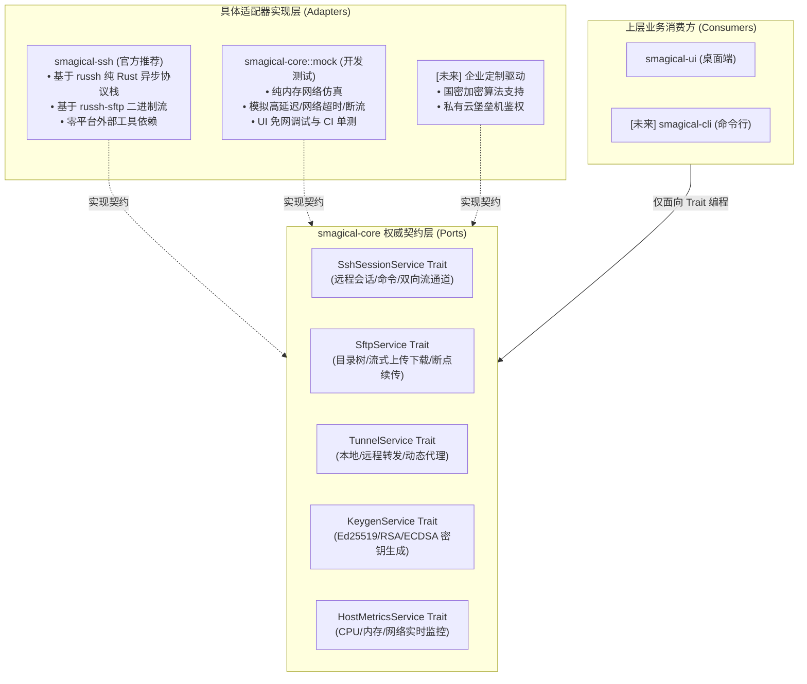

# smagical-core

`smagical-core` 是 **smalux-ssh** 的核心业务领域、状态引擎与数据仓储契约层 crate。它采用纯 Rust 编写，**严禁引入任何桌面图形界面框架（如 Slint / Qt / GTK）**，保证全系统核心业务逻辑的高内聚性、跨平台可移植性（CLI / GUI / Headless Daemon 通用）以及极高的单元测试覆盖率。

---

## 📁 目录结构与模块全景

```text
crates/smagical-core/
├── Cargo.toml                  # 依赖清单 (serde, tokio, reqwest, thiserror 等)
├── README.md                   # 模块架构与子模块职责规范文档 (本文档)
└── src/
    ├── lib.rs                  # 顶层入口与高频领域类型重新导出
    ├── domain/                 # 核心领域实体模型与业务规则 (13 个子模块)
    │   ├── mod.rs              # 领域子模块集中导出
    │   ├── host.rs             # SSH 主机资产实体 (HostRecord) 与状态机 (HostStatus)
    │   ├── group.rs            # 资产无限层级分组 (GroupRecord)
    │   ├── credential.rs       # 身份认证凭据 (CredentialRecord, CredentialType: 密码/私钥/证书/Agent)
    │   ├── tunnel.rs           # 端口转发与跳板机 (TunnelRecord, TunnelType, TunnelRunMode, JumpHopRecord)
    │   ├── snippet.rs          # 自动化脚本片段与参数化模板 (SnippetRecord, SnippetGroupRecord, SnippetVariable)
    │   ├── history.rs          # 会话连接审计历史 (HistoryRecord) 与终端快照配置 (SessionSnapshotConfig)
    │   ├── file_item.rs        # 双盘文件浏览器模型 (FileItemData)、Tab 历史栈会话与传输任务队列 (TransferTask)
    │   ├── ai.rs               # 原生纯 Rust 异步流式 AI 客户端 (AiClient, SSE 流解析, 指令风险研判)
    │   ├── config.rs           # 全局偏好与系统配置模型 (AppConfigRecord)
    │   ├── activity_bar.rs     # 左侧活动栏动态扩展与注册中心 (ActivityBarItem, ActivityBarRegistry)
    │   ├── right_panel.rs      # 右侧伴生辅助面板注册中心 (RightPanelItem, RightPanelRegistry)
    │   ├── navigation.rs       # 全局页面路由与导航历史中枢 (NavigationRequest, NavigationRouter)
    │   └── terminal_context.rs # 活跃终端上下文与交互指令载荷 (ActiveTerminalSessionContext, TerminalAction)
    ├── event/                  # 强类型泛型事件分发总线与全生命周期拦截守护
    │   ├── mod.rs              # 事件系统统一入口
    │   ├── types.rs            # 全局 30+ 项领域事件定义 (凭据安全、生命周期、拦截器等)
    │   ├── traits.rs           # 核心分发契约 (AppEvent, CancellableEvent)
    │   ├── dispatcher.rs       # 高性能无锁读/强隔离并发泛型事件分发器 (EventDispatcher)
    │   ├── manager.rs          # 集中式事件总线管理器 (EventManager, 作用域管理)
    │   ├── guard.rs            # RAII 监听器生命周期守护凭证 (ListenerGuard)
    │   └── tests.rs            # 事件总线并发与拦截器单元测试
    ├── storage/                # 数据仓储契约层 (Storage Abstraction Layer)
    │   └── mod.rs              # 7 大 Repository Trait、AppStorage 门面契约与 StorageError
    ├── state/                  # 应用全局上下文状态机
    │   ├── mod.rs              # 状态模块导出
    │   └── core_state.rs       # CoreState: 统一调度存储门面、事件总线、动态侧栏与路由
    └── theme/                  # 主题系统核心领域层
        ├── mod.rs              # 主题模块统一导出
        ├── model.rs            # 主题元数据与色彩令牌定义 (ThemeDefinition, UiTheme, TerminalTheme)
        ├── repository.rs       # 文件主题仓储契约与内置预设管理
        ├── validation.rs       # WCAG 2.1 颜色对比度安全合规算法与校验器
        ├── selection.rs        # 主题多级继承 (Base Theme) 递归展开解析引擎
        └── service.rs          # ThemeService 主题业务门面服务
```

---

## 🧩 各子模块 (`mod`) 详细职责解析

### 1. `domain` - 业务领域实体

该模块封装了系统中最关键的业务实体与领域规则，所有数据模型均具备完备的 Serde 序列化能力，且不依赖任何 UI 细节：

- **[`domain::host`](src/domain/host.rs)**：
  - **`HostRecord`**：表示单个 SSH 主机连接资产，记录主机 ID、显示名称、IP/域名、SSH 端口、归属分组 ID、排序权重及备注信息；
  - **`HostStatus` 枚举**：强类型状态机（`Online`, `Offline`, `Warning`, `Error`），提供双向安全解析与展示。
- **[`domain::group`](src/domain/group.rs)**：
  - **`GroupRecord`**：支持无限层级嵌套的分组实体，包含 `id`, `name`, `parent_id` (可选), `level` (层级深度), `is_expanded` (UI 展开态) 与 `sort_order`；
  - 提供 `GroupRecord::root(...)` 与 `GroupRecord::child(...)` 快速构造器。
- **[`domain::credential`](src/domain/credential.rs)**：
  - **`CredentialRecord`**：安全认证资产凭据，支持密码、SSH 私钥（支持带 Passphrase 保护）、证书认证及 SSH Agent 代理模式；
  - 记录加密算法、公钥指纹、最后使用时间，用于配合安全保险库进行字段级加密。
- **[`domain::tunnel`](src/domain/tunnel.rs)**：
  - **`TunnelRecord`**：统一网络隧道与代理配置模型，支持本地端口转发 (`Local`)、远端端口转发 (`Remote`)、动态 SOCKS5 代理 (`Dynamic`)、Bastion 跳板机 (`JumpHost`) 与通用代理服务端 (`ProxyServer`)；
  - **`JumpHopRecord`**：支持多跳跳板链路拓扑定义与成环检测。
- **[`domain::snippet`](src/domain/snippet.rs)**：
  - **`SnippetRecord`**：可复用的运维代码片段，支持提取动态参数模板变量（如 `{{target_dir}}`）、快捷语法高亮类型标记与直接注入终端执行；
  - **`SnippetGroupRecord`**：片段文件夹分组树模型。
- **[`domain::history`](src/domain/history.rs)**：
  - **`HistoryRecord`**：会话连接足迹审计记录，追踪连接时长、退出码、终端屏幕快照关联；支持置顶标星收藏与清理过滤；
  - **`SessionSnapshotConfig`**：控制屏幕快照留存行数与脱敏策略。
- **[`domain::file_item`](src/domain/file_item.rs)**：
  - **`FileItemData`**：双盘文件管理器统一文件/目录节点模型，内置权限字符串解析与人类可读文件大小格式化；
  - **`LocalFileTabSession` / `RemoteFileTabSession`**：文件浏览器 Tab 会话状态模型，内嵌带分支清理机制的双向导航历史记录栈；
  - **`TransferTask`**：文件传输任务树实体，追踪传输方向（上传/下载）、字节进度、瞬时速率与层级递归结构。
- **[`domain::ai`](src/domain/ai.rs)**：
  - **`AiClient`**：纯 Rust 原生编写的异步流式大语言模型客户端（基于 `reqwest`），兼容 OpenAI / DeepSeek / Claude / Ollama 协议；
  - **`parse_sse_line`**：标准的 Server-Sent Events (SSE) 流式解析器，支持 `data: [DONE]` 边界自动识别；
  - **`assess_command_risk`**：命令安全防线，基于正则与词法检测识别高危命令（如 `rm -rf /`、格式化磁盘、覆写 MBR 等）并输出风险告警；
  - **`extract_shell_command`**：智能从 Markdown 代码块中剥离可直接执行的 Shell 语句。
- **[`domain::config`](src/domain/config.rs)**：
  - **`AppConfigRecord`**：系统全局配置快照（终端默认字体、滚动回滚行数、默认保活心跳、AI 端点、主题模式等）。
- **[`domain::activity_bar`](src/domain/activity_bar.rs)** 与 **[`domain::right_panel`](src/domain/right_panel.rs)**：
  - 侧边栏与辅助工具抽屉的动态扩展注册中心模型，支持插件或第三方模块动态声明并插拔侧边栏入口。
- **[`domain::navigation`](src/domain/navigation.rs)**：
  - **`NavigationRouter`**：页面统一路由中枢，支持历史后退/前进，并在切换视图时派发生命周期事件。
- **[`domain::terminal_context`](src/domain/terminal_context.rs)**：
  - **`ActiveTerminalSessionContext`** 与 **`TerminalAction`**：活跃终端会话快照与向终端投递执行指令（如执行片段、清屏、重连）的指令通道载荷。

---

### 2. `event` - 强类型并发事件总线

提供高性能、类型安全、松耦合的事件发布-订阅体系与领域拦截守护：

- **`EventDispatcher`**：
  - 基于 `TypeId` 泛型映射的高性能事件分发器，内部使用读写锁保障多线程安全；
  - 具备独立派发与按序回调机制，支持广播全局事件。
- **`ListenerGuard`**：
  - 基于 RAII 设计模式的监听器生命周期守护凭证，离开作用域自动安全注销监听；亦支持 `.detach()` 将监听器生命周期提升至全局常驻。
- **`EventManager`**：
  - 统一管理全局事件通道与临时局部作用域事件通道。
- **内建全生命周期安全审计与拦截器**：
  - **凭据审计**：复制明文密码/私钥时自动记录高危安全审计日志；
  - **文件破坏防护**：监听 `FileOperationBeforeEvent`，在本地文件删除操作触发前自动拦截系统级危险目录（如 `C:\`、`/`、`System32`、`/etc/passwd` 等）；
  - **跳板机成环拦截**：监听 `TunnelBeforeSaveEvent`，深度检测跳板链路节点，杜绝死循环拓扑；
  - **运行中隧道保护**：监听 `TunnelBeforeDeleteEvent`，阻断对当前处于活跃状态的网络隧道进行误删除。

---

### 3. `storage` - 数据存储契约抽象层

通过完全面向接口（Trait-Driven）的设计，解耦上层业务与具体底层物理实现（SQLite、加密文件、远程数据库或内存 Mock）：

- **`HostRepository`**：主机资产的增删改查、根据绑定的凭据反查引用、列表视觉排序更新；
- **`GroupRepository`**：分组树的持久化、折叠状态记录、父子层级动态迁移；
- **`CredentialRepository`**：安全凭据存取、按类型分类索引、全文模糊检索、查询被哪些主机绑定引用；
- **`TunnelRepository`**：网络隧道/代理规则存储、按类别筛选、运行状态标记、实时流量吞吐指标更新；
- **`SnippetRepository`**：代码片段与多级分组持久化、收藏置顶管理、全文模糊检索；
- **`HistoryRepository`**：会话连接历史倒序检索、一键清理、单项置顶、终端屏幕输出快照存储与读取；
- **`ConfigRepository`**：全局偏好设置的快照读取、全量存储、默认值重置与闭包原子变更；
- **`AppStorage` 聚合门面**：
  - 统一收敛上述 7 大仓储句柄；
  - 提供数据介质重载 (`reload()`) 与强制刷盘 (`flush()`) 契约；
  - **定义安全保险库生命周期契约**：`is_vault_unlocked()`, `lock_vault()`, `has_custom_master_password()`, `unlock_vault()`, `change_master_password()`, `remove_master_password()`。

---

### 4. `state` - 应用全局状态机引擎

- **`CoreState`**：
  - 整个应用核心业务的单一真相来源（Single Source of Truth）；
  - 持有 `Arc<RwLock<Arc<dyn AppStorage>>>`，原生支持在运行时无缝**热插拔切换底层存储介质**（如从初始 Mock 模式动态升级切换至 SQLite 物理持久化模式）；
  - 统一装配集中式事件总线管理器；
  - 维护侧边栏动态注册表、右侧辅助面板注册表、当前聚焦终端会话上下文与统一导航路由中枢。

---

### 5. `theme` - 主题核心领域与校验引擎

- **`ThemeDefinition`**：统一定义 UI 配色（背景、边框、前景色、卡片底色等）与 Terminal 配色（ANSI 16 色与光标/选择区）；
- **`ThemeValidation`**：内置符合 WCAG 2.1 规范的相对亮度与颜色对比度算法，能预先发现文本可读性不足的主题；
- **`ThemeSelection`**：支持多级 Base 主题递归继承，自动补齐未覆盖的色值令牌；
- **`ThemeService`**：提供主题的导入（支持 Windows Terminal 配色预设导入）、导出、校验与持久化。

---

## 🔌 核心服务契约体系规范 (Core Service Contracts Specification)

为了贯彻**依赖倒置原则 (DIP)** 与**六边形架构 (Ports & Adapters)**，`smagical-core` 将作为整个系统的**唯一权威契约中心**。系统所有的网络与协议能力（SSH 连接、SFTP 传输、网络隧道、密钥生成、系统监控）均由 `core` 层抽象为统一的 `async_trait` 契约，**具体底层驱动实现（如 `smagical-ssh` 纯 Rust 驱动、Mock 仿真驱动或第三方驱动）完全可热插拔替换**。



### 1. 核心服务 Trait 定义设计规范

#### ① SFTP 文件传输契约 (`SftpService`)
```rust
#[async_trait::async_trait]
pub trait SftpService: Send + Sync {
    /// 获取远程目录下的所有文件与目录项
    async fn list_dir(&self, session_id: &str, remote_path: &str) -> Result<Vec<FileItemData>, SshServiceError>;
    /// 获取远程单个文件或目录的元数据
    async fn stat_path(&self, session_id: &str, remote_path: &str) -> Result<FileItemData, SshServiceError>;
    /// 递归创建远程目录
    async fn create_dir(&self, session_id: &str, remote_path: &str) -> Result<(), SshServiceError>;
    /// 删除远程文件或目录 (recursive: 是否递归删除子项)
    async fn remove_path(&self, session_id: &str, remote_path: &str, recursive: bool) -> Result<(), SshServiceError>;
    /// 重命名或移动远程路径
    async fn rename(&self, session_id: &str, old_path: &str, new_path: &str) -> Result<(), SshServiceError>;
    /// 流式下载远程文件至本地 (支持进度与取消回调)
    async fn download_file(
        &self,
        session_id: &str,
        remote_path: &str,
        local_path: &str,
        progress_tx: Option<tokio::sync::mpsc::UnboundedSender<TransferProgress>>,
    ) -> Result<(), SshServiceError>;
    /// 流式上传本地文件至远程 (支持进度与取消回调)
    async fn upload_file(
        &self,
        session_id: &str,
        local_path: &str,
        remote_path: &str,
        progress_tx: Option<tokio::sync::mpsc::UnboundedSender<TransferProgress>>,
    ) -> Result<(), SshServiceError>;
}
```

#### ② SSH 终端与会话契约 (`SshSessionService`)
```rust
/// 抽象的终端连续双向字节读写流通道 (与 UI 软光栅渲染器解耦)
pub trait SshStreamChannel: tokio::io::AsyncRead + tokio::io::AsyncWrite + Send + Sync + Unpin {}

#[async_trait::async_trait]
pub trait SshSessionService: Send + Sync {
    /// 建立远程 SSH 会话连接 (包含指纹校验、鉴权认证与保活心跳)
    async fn connect(
        &self,
        host: &HostRecord,
        credential: Option<&CredentialRecord>,
    ) -> Result<String, SshServiceError>; // 返回 session_id

    /// 打开交互式 PTY 虚拟终端通道
    async fn open_pty_channel(
        &self,
        session_id: &str,
        term_type: &str,
        rows: u16,
        cols: u16,
    ) -> Result<Box<dyn SshStreamChannel>, SshServiceError>;

    /// 动态调整 PTY 视口窗口尺寸
    async fn resize_pty(&self, session_id: &str, rows: u16, cols: u16) -> Result<(), SshServiceError>;

    /// 单次非交互式执行远程命令并返回标准输出/错误
    async fn execute_command(&self, session_id: &str, command: &str) -> Result<CommandExecutionOutput, SshServiceError>;

    /// 断开并释放指定 SSH 会话
    async fn disconnect(&self, session_id: &str) -> Result<(), SshServiceError>;
}
```

#### ③ 网络隧道与端口转发契约 (`TunnelService`)
```rust
#[async_trait::async_trait]
pub trait TunnelService: Send + Sync {
    /// 根据配置启动一条隧道或代理规则 (本地转发/远程转发/SOCKS5/跳板机)
    async fn start_tunnel(
        &self,
        tunnel: &TunnelRecord,
        credential: Option<&CredentialRecord>,
    ) -> Result<TunnelHandle, SshServiceError>;

    /// 停止指定运行中的网络规则
    async fn stop_tunnel(&self, tunnel_id: &str) -> Result<(), SshServiceError>;

    /// 查询指定隧道的即时吞吐度量 (当前活跃连接数, 入向增量, 出向增量)
    async fn query_metrics(&self, tunnel_id: &str) -> Result<TunnelMetricsSnapshot, SshServiceError>;
}
```

#### ④ 密钥生成与格式服务契约 (`KeygenService`)
```rust
pub trait KeygenService: Send + Sync {
    /// 原生纯 Rust 生成指定算法的密钥对 (Ed25519 / RSA-4096 / ECDSA)
    fn generate_keypair(
        &self,
        algorithm: KeyAlgorithm,
        bits: Option<u32>,
        passphrase: Option<&str>,
    ) -> Result<GeneratedKeyPair, SshServiceError>;

    /// 计算公钥的标准 SHA256 格式指纹 (如 "SHA256:xxxx...")
    fn compute_fingerprint(&self, public_key_openssh: &str) -> Result<String, SshServiceError>;
}
```

#### ⑤ 远程性能监控采集契约 (`HostMetricsService`)
```rust
#[async_trait::async_trait]
pub trait HostMetricsService: Send + Sync {
    /// 采集指定主机的系统即时负载快照 (CPU 使用率, 内存占比, 磁盘空间, 网络 I/O)
    async fn sample_metrics(&self, session_id: &str) -> Result<SystemMetricsSnapshot, SshServiceError>;
}
```

---

### 2. 状态机集成机制 (`CoreState` 依赖注入)

与 `storage` 保持完全一致的持有与注入风格：

```rust
impl CoreState {
    /// 获取当前生效的 SFTP 服务门面
    pub fn sftp(&self) -> Arc<dyn SftpService>;
    /// 获取当前生效的 SSH 会话服务门面
    pub fn ssh(&self) -> Arc<dyn SshSessionService>;
    /// 获取当前生效的网络隧道服务门面
    pub fn tunnels(&self) -> Arc<dyn TunnelService>;
    /// 获取密钥生成服务门面
    pub fn keygen(&self) -> Arc<dyn KeygenService>;

    /// 动态替换或热插拔协议驱动实现 (例如在测试模式下切换为 MockSftpService)
    pub fn set_sftp_service(&self, service: Arc<dyn SftpService>);
    pub fn set_ssh_service(&self, service: Arc<dyn SshSessionService>);
}
```

---

### 3. 实现要求与原则规范 (未来编码守则)

1. **统一错误枚举 (`SshServiceError`)**：Core 层定义 `AuthFailed`, `HostUnreachable`, `Timeout`, `PermissionDenied`, `ProtocolError`, `ChannelClosed` 等规范错误，禁止将底层第三方库原生错误直接抛给上层；
2. **零平台命令泄漏**：实现类（如 `smagical-ssh`）严禁调用 `std::process::Command` 拉起宿主机系统外部进程；
3. **Mock 优先健全测试**：Core 层配套提供轻量级 `MockSftpService` 与 `MockSshService`，让 UI 和 CLI 可以在完全断网的环境下运行 100% 的自动化测试。

---

## 🔒 关键设计原则

1. **绝对无 GUI 依赖**：禁止引用 Slint、winit 等任何界面库。任何需要通知 UI 渲染的变动均通过 `EventManager` 广播强类型事件或由上层主动拉取；
2. **纯 Rust 自研优先**：严禁调用平台特定的外部系统进程（如直接拉起 `ssh.exe` 或运行外部命令）；所有逻辑使用纯 Rust 原生 crate 实现；
3. **接口与实现彻底分离**：所有数据操作必须面向 `AppStorage` 与各仓储 Trait 编程，为后续分布式同步或云端同步保留完备扩展性。

---

## 🧪 单元测试

```bash
cargo test -p smagical-core
```
涵盖全领域模型构建、事件总线分发与拦截、AI 流式解析与指令安全研判、主题继承与对比度计算等 57+ 项自动化单元测试，确保核心代码高可靠。

