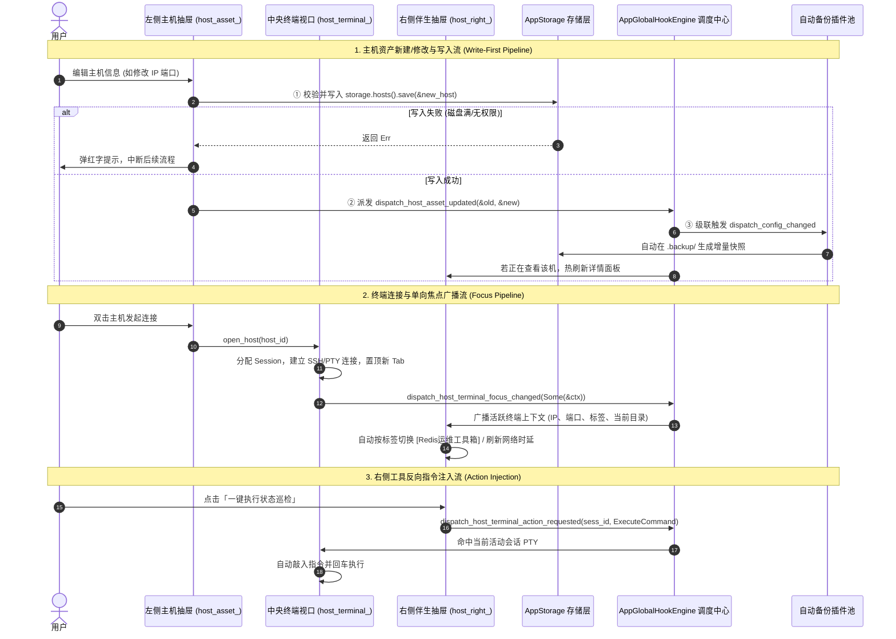

# 🌐 AppGlobalHook 全局应用级 Hook 体系与架构设计白皮书

本文档详细记录 `smagical-core` 中 **应用级全局生命周期、三栏协同与全域导航 Hook 体系 (`AppGlobalHook`)** 的设计哲学、三栏架构分层、数据流转时序与全部具体方法规格，供后续扩展、审计与开发同风格新 Hook 查阅。

---

## 🎯 1. 核心设计哲学 (Core Philosophy)

1. **三栏隔离与明确边界 (Three-Column Decoupling)**：
   - **左侧主机资产栏 (`host_asset_`)**：仅关注资产 CRUD、分组树拓扑、搜索过滤与网络探针探活。发射终端后即解绑，后续在左侧重命名主机、拖拽分组，**绝不干扰中央已运行的终端会话**；
   - **中央终端视口 (`host_terminal_`)**：作为单向焦点真相源（Focus Truth），负责广播当前聚焦的会话上下文快照，并被动接收来自右侧栏的动作注入；
   - **右侧伴生辅助栏 (`host_right_`)**：作为伴生观察与工具箱，实时监听中央活动终端的焦点切换，自动热重载详情、代码片段、SFTP 与 AI 工具，并可向中央终端反向注入指令。
2. **写数据先行与事件单向驱动 (Write-First & Domain Event Cascade)**：
   - **核心数据必须先落盘**（`storage.hosts().save()`），确保事务与异常阻断；
   - 落盘成功后派发领域 Hook（`dispatch_host_asset_...`）；
   - 通用配置守护插件（如 `AutoConfigBackupHook`）在下游统一捕获并生成增量备份快照。
3. **物理隔离与零开销热路径 (Panic-Safe & Zero-Cost)**：
   - 每个 Hook 派发均由 `panic::catch_unwind` 隔离，单个插件崩溃绝不波及主界面；
   - 高频数据流（如终端屏幕切片）采用零拷贝直达通道（`&[u8]`），0 堆内存分配。

---

## 🗺️ 2. 主机管理主页「三栏流转与协同」时序图

---

## 📋 3. 全部具体 Hook 方法规格与参数详解

### 基础元数据方法
| 方法名 | 签名 | 说明 |
| :--- | :--- | :--- |
| **`name`** | `fn name(&self) -> &'static str` | 插件全局唯一标识字符串 (如 `"builtin_auto_config_backup"`)。 |
| **`priority`** | `fn priority(&self) -> i32` | 插件优先级 (默认 `0`，数值越大越先执行；安全守护插件可设为 `100`)。 |

---

### 板块一：左侧主机资产抽屉域 (`host_asset_`)
| 方法名 | 完整方法签名 | 说明与典型应用 |
| :--- | :--- | :--- |
| **`on_host_asset_created`** | `fn on_host_asset_created(&self, host: &HostRecord)` | 新建主机资产保存后触发，驱动启动器索引增量更新。 |
| **`on_host_asset_updated`** | `fn on_host_asset_updated(&self, old_host: &HostRecord, new_host: &HostRecord)` | 主机配置变更后触发，驱动右侧栏热重载与增量备份。 |
| **`on_host_asset_deleted`** | `fn on_host_asset_deleted(&self, host_id: &str)` | 删除主机资产后触发，清理关联收藏与历史关联。 |
| **`on_host_asset_group_created`** | `fn on_host_asset_group_created(&self, group: &GroupRecord)` | 新建分组（Root 或多层级嵌套）后触发。 |
| **`on_host_asset_group_updated`** | `fn on_host_asset_group_updated(&self, group: &GroupRecord)` | 分组重命名或调整上级父节点时触发。 |
| **`on_host_asset_group_deleted`** | `fn on_host_asset_group_deleted(&self, group_id: &str)` | 分组被删除时触发。 |
| **`on_host_asset_group_toggled`** | `fn on_host_asset_group_toggled(&self, group_id: &str, is_expanded: bool)` | 侧边栏树形文件夹折叠/展开时触发，自动持久化状态。 |
| **`on_host_asset_tree_reordered`** | `fn on_host_asset_tree_reordered(&self, src_id: &str, target_id: &str, drop_position: &str)` | 拖拽调序或跨分组移动完成后触发。 |
| **`on_host_asset_search_filtered`** | `fn on_host_asset_search_filtered(&self, query: &str, match_count: usize)` | 搜索框键入字符实时过滤树与卡片时触发。 |
| **`on_host_asset_selected_for_preview`** | `fn on_host_asset_selected_for_preview(&self, host: Option<&HostRecord>)` | 单击卡片选中预览时触发，右侧栏展示静态配置。 |
| **`on_host_asset_status_probed`** | `fn on_host_asset_status_probed(&self, host_id: &str, status: HostStatus, ping_ms: i32)` | 后台探针定时 ping 检测主机状态与网络延迟变动时触发。 |

---

### 板块二：中央终端工作区域 (`host_terminal_`)
| 方法名 | 完整方法签名 | 说明与典型应用 |
| :--- | :--- | :--- |
| **`on_host_terminal_opening`** | `fn on_host_terminal_opening(&self, host_id: &str, is_local: bool) -> HookDecision` | **【连接前拦截（责任链）】**：校验并发连接数配额或准备代理跳板。 |
| **`on_host_terminal_opened`** | `fn on_host_terminal_opened(&self, session_id: &str, ctx: &ActiveTerminalSessionContext)` | 终端会话创建并挂载 Tab 完毕。 |
| **`on_host_terminal_focus_changed`** | `fn on_host_terminal_focus_changed(&self, ctx: Option<&ActiveTerminalSessionContext>)` | **【焦点流核心】**：Tab 切换、多分屏选窗格或关闭时广播活动终端快照。 |
| **`on_host_terminal_split_changed`** | `fn on_host_terminal_split_changed(&self, pane_count: usize, active_pane_id: &str, is_split: bool)` | 多分屏二叉树结构或分割比例发生变动。 |
| **`on_host_terminal_title_renamed`** | `fn on_host_terminal_title_renamed(&self, session_id: &str, new_title: &str)` | 用户双击 Tab 重命名或远端 OSC 0/2 协议更新标题。 |
| **`on_host_terminal_bell_triggered`** | `fn on_host_terminal_bell_triggered(&self, session_id: &str)` | 终端触发 `\x07` 蜂鸣符，驱动窗口闪烁或声音提醒。 |
| **`on_host_terminal_closing`** | `fn on_host_terminal_closing(&self, session_id: &str) -> HookDecision` | **【关闭前守护（责任链）】**：检测当前任务防止误关。 |
| **`on_host_terminal_closed`** | `fn on_host_terminal_closed(&self, session_id: &str, duration_secs: u64)` | 终端彻底销毁，屏幕快照与耗时已持久化落盘。 |

---

### 板块三：右侧辅助伴生抽屉域 (`host_right_`)
| 方法名 | 完整方法签名 | 说明与典型应用 |
| :--- | :--- | :--- |
| **`on_host_right_drawer_toggled`** | `fn on_host_right_drawer_toggled(&self, is_open: bool, active_panel_id: &str)` | 右侧抽屉展开/收起（收起时自动挂起面板以节省 CPU）。 |
| **`on_host_right_drawer_resized`** | `fn on_host_right_drawer_resized(&self, width: f32)` | 鼠标拖拽调整右侧抽屉宽度时触发。 |
| **`on_host_right_panel_switched`** | `fn on_host_right_panel_switched(&self, panel_id: &str, is_open: bool)` | 切换伴生面板（`info`, `snippets`, `sftp`, `ai`）。 |
| **`on_host_right_panel_registered`** | `fn on_host_right_panel_registered(&self, item: &RightPanelItem)` | 动态注册新的右侧插件面板（热插拔体系）。 |
| **`on_host_right_panel_unregistered`** | `fn on_host_right_panel_unregistered(&self, panel_id: &str)` | 卸载或隐藏右侧面板。 |
| **`on_host_right_terminal_action_requested`** | `fn on_host_right_terminal_action_requested(&self, session_id: &str, action: &TerminalAction)` | **【反向注入通道】**：右侧面板请求向当前终端注入指令/文本/清屏。 |
| **`on_host_right_sftp_sync_requested`** | `fn on_host_right_sftp_sync_requested(&self, session_id: &str, remote_path: &str)` | SFTP 面板请求跟随终端当前工作目录同步。 |

---

### 板块四：框架外壳与全局导航域 (`shell_`)
| 方法名 | 完整方法签名 | 说明与典型应用 |
| :--- | :--- | :--- |
| **`on_shell_navigation_requested`** | `fn on_shell_navigation_requested(&self, req: &NavigationRequest)` | 统一全局路由跳转。 |
| **`on_shell_module_activated`** | `fn on_shell_module_activated(&self, tab_id: &str, sub_sec: Option<&str>, params: &HashMap<..>)` | 页面模块切入挂载（主机页/历史页/设置页）。 |
| **`on_shell_module_deactivated`** | `fn on_shell_module_deactivated(&self, tab_id: &str)` | 页面模块切出休眠。 |
| **`on_shell_left_menu_clicked`** | `fn on_shell_left_menu_clicked(&self, menu_id: &str, old_menu_id: &str)` | 左侧 48px 图标点击。 |
| **`on_shell_main_view_switched`** | `fn on_shell_main_view_switched(&self, current_view: &str, previous_view: &str)` | 中央工作区视图流转（终端视口 ⇄ 历史中心）。 |
| **`on_shell_modal_toggled`** | `fn on_shell_modal_toggled(&self, modal_id: &str, is_open: bool)` | 全局模态弹窗显隐（新建会话、Debug 等）。 |
| **`on_shell_command_executed`** | `fn on_shell_command_executed(&self, command_id: &str)` | Ctrl+K 全局指令分发。 |
| **`on_shell_window_state_changed`** | `fn on_shell_window_state_changed(&self, state: WindowState)` | 窗口最小化/最大化/还原。 |

---

### 板块五：历史、凭据、片段、设置与进程生命周期
| 业务域 | 方法名 | 说明与典型应用 |
| :--- | :--- | :--- |
| **`history_`** | `on_history_session_recorded` `on_history_item_deleted` `on_history_cleared` `on_history_pin_toggled` `on_history_reconnect_requested` | 会话历史落盘、单项删除、一键清空、置顶切换与双击重连。 |
| **`credential_`** | `on_credential_created` `on_credential_updated` `on_credential_deleted` | SSH 密钥对/密码凭据的增删改通知。 |
| **`snippet_`** | `on_snippet_created` `on_snippet_updated` `on_snippet_deleted` `on_snippet_executed` | 代码片段运维库管理与终端执行记录。 |
| **`config_` / `theme_`** | `on_config_changed` `on_config_reset` `on_theme_mode_toggled` `on_theme_changed` | 全局参数修改（触发增量备份）、深浅色与预设主题应用。 |
| **`app_`** | `on_app_boot` `on_app_ready` `on_app_before_exit` `on_app_exit` | 应用启动引导、首帧就绪并发预热、退出前安全拦截与最终全量归档。 |
