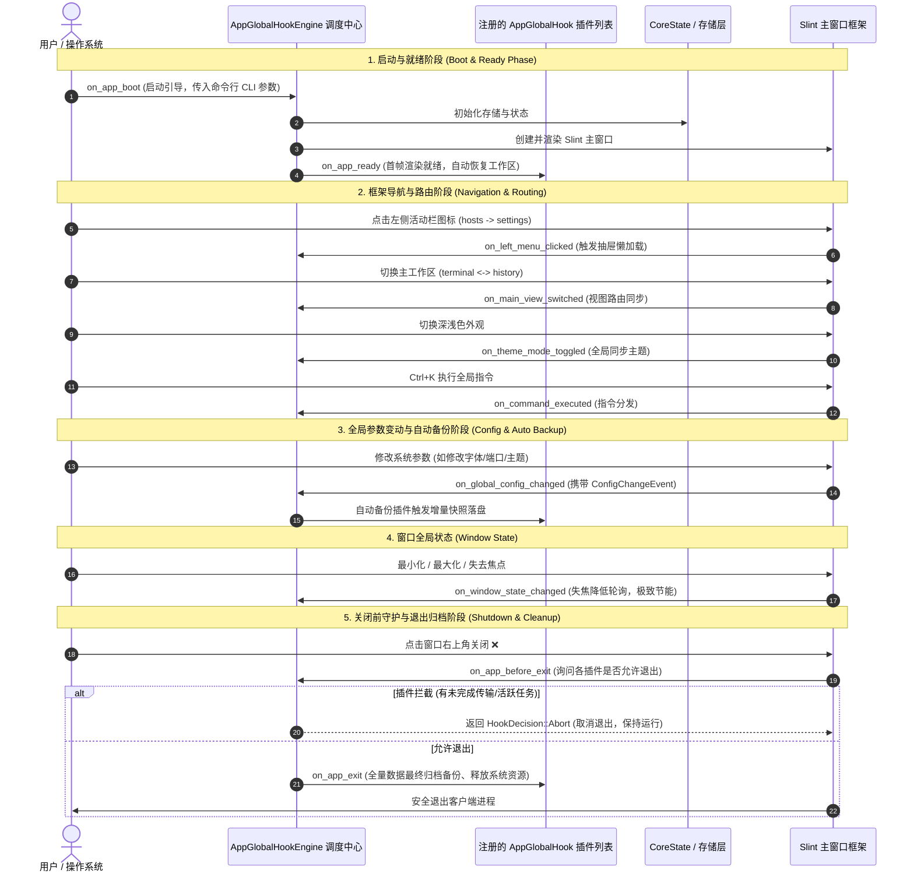

# 🌐 AppGlobalHook 全局应用级 Hook 体系与设计哲学

本文档详细记录 `smagical-core` 中 **应用级全局生命周期与主框架导航 Hook 体系 (`AppGlobalHook`)** 的设计哲学、架构分层与**全部具体方法**的详细参数规格，供后续扩展、审计与开发同风格新 Hook 查阅。

---

## 🎯 1. 核心设计哲学 (Core Philosophy)

- **宏观/全局框架级 (Macro / App Level)**：聚焦在**整个客户端进程生命周期、应用主框架（左右导航抽屉、主工作区路由）与全局参数配置变动**；
- **低频状态驱动**：事件触发频次低（如启动一次、切换菜单一次、修改配置一次），对 UI 渲染性能 0 负面影响；
- **严格的设计边界 (Critical Rule)**：
  > [!IMPORTANT]
  > **“能分配到单独页面的具体业务（如主机树的节点操作、历史会话删除、终端视口按键），一律留在各个页面的专属局部 Hook，绝不混入全局 Hook！”**
  > **全局 Hook 仅收敛整个应用主框架（左右菜单、视图路由、顶栏控制、全局参数变动自动备份、启动与退出）的顶层事件！**

---

## 🗺️ 2. 全局应用级生命周期流转图



---

## 📋 3. 全部具体 Hook 方法规格与参数详解

### 基础元数据方法
| 方法名 | 签名 | 说明 |
| :--- | :--- | :--- |
| **`name`** | `fn name(&self) -> &'static str` | 插件全局唯一标识字符串 (如 `"builtin_auto_config_backup"`)。 |
| **`priority`** | `fn priority(&self) -> i32` | 插件优先级 (默认 `0`，数值越大越先执行；安全守护插件可设为 `100`)。 |

---

### 板块一：进程启动与就绪 (Boot & Ready Phase)
| 方法名 | 完整方法签名 | 入参说明 | 返回值与控制流 | 典型应用场景 |
| :--- | :--- | :--- | :---: | :--- |
| **`on_app_boot`** | `fn on_app_boot(&self, ctx: &AppBootContext)` | • `ctx.cli_args`: 启动命令行参数列表<br>• `ctx.started_at`: 启动时间戳 | 无 | 解析 CLI 参数（如 `smalux-ssh --host=1.2.3.4`）、检查单实例互斥锁。 |
| **`on_app_ready`** | `fn on_app_ready(&self)` | 无 | 无 | Slint 主窗口首帧绘制就绪，自动恢复上次未关闭的分屏工作区、异步检查新版本更新。 |

---

### 板块二：主框架导航与交互路由 (Shell Navigation)
| 方法名 | 完整方法签名 | 入参说明 | 返回值与控制流 | 典型应用场景 |
| :--- | :--- | :--- | :---: | :--- |
| **`on_left_menu_clicked`** | `fn on_left_menu_clicked(&self, menu_id: &str, old_menu_id: &str)` | • `menu_id`: 目标菜单 ("hosts", "history", "files", "credentials", "settings")<br>• `old_menu_id`: 切换前的菜单 | 无 | 记录用户导航路径；左侧抽屉按需懒加载数据。 |
| **`on_main_view_switched`** | `fn on_main_view_switched(&self, current_view: &str, previous_view: &str)` | • `current_view`: 目标工作区 ("terminal" / "history")<br>• `previous_view`: 切换前视图 | 无 | 从终端切到历史中心时刷新历史快照，切回终端时重新聚焦活跃会话。 |
| **`on_theme_mode_toggled`** | `fn on_theme_mode_toggled(&self, is_dark: bool)` | • `is_dark`: 当前是否为深色模式 | 无 | 联动更新全局设计令牌、同步切换终端 ANSI 调色板与壁纸。 |
| **`on_command_executed`** | `fn on_command_executed(&self, command_id: &str)` | • `command_id`: 指令唯一标识 (通过 Ctrl+K 命令面板触发) | 无 | 响应全局快捷操作（如一键重载配置、切换全屏模式）。 |


---

### 板块三：全局参数变动与自动备份 (Config Mutation & Backup) —— *核心备份能力*
| 方法名 | 完整方法签名 | 入参说明 | 返回值与控制流 | 典型应用场景 |
| :--- | :--- | :--- | :---: | :--- |
| **`on_global_config_changed`** | `fn on_global_config_changed(&self, event: &ConfigChangeEvent)` | • `event.key`: 参数键名 (如 `"terminal.font_size"`)<br>• `event.old_val`: 变动前原值<br>• `event.new_val`: 变动后新值<br>• `event.source`: 变动来源 | 无 | **修改任意配置时，自动生成增量快照备份（如 `.backup/config_xxx.json`）或触发 Git 自动提交**。 |

---

### 板块四：窗口全局状态变动 (Window State)
| 方法名 | 完整方法签名 | 入参说明 | 返回值与控制流 | 典型应用场景 |
| :--- | :--- | :--- | :---: | :--- |
| **`on_window_state_changed`** | `fn on_window_state_changed(&self, state: WindowState)` | • `state`: `Normal`, `Minimized`, `Maximized`, `Focused`, `Unfocused` | 无 | 窗口失去焦点或最小化时，自动降低终端渲染帧率与探针频率，实现极致节能。 |

---

### 板块五：关闭前守护与退出清理 (Shutdown & Cleanup)
| 方法名 | 完整方法签名 | 入参说明 | 返回值与控制流 | 典型应用场景 |
| :--- | :--- | :--- | :---: | :--- |
| **`on_app_before_exit`** | `fn on_app_before_exit(&self, ctx: &AppExitContext) -> HookDecision` | • `ctx.active_sessions_count`: 活跃会话数<br>• `ctx.is_forced`: 是否强制退出 | `HookDecision`<br>(支持 `Abort { reason }`) | **退出前守护**：若当前有未完成任务或活跃连接，返回 `Abort` 拦截退出流程并弹窗提醒。 |
| **`on_app_exit`** | `fn on_app_exit(&self, ctx: &AppExitContext)` | • `ctx`: 最终退出上下文 (包含退出码) | 无 | **应用退出前执行最终全量数据归档备份**、保存工作区快照、彻底释放底层句柄。 |

---

## 📦 4. 核心数据模型定义 (Types & Structures)

```rust
/// 全局参数变动事件上下文
pub struct ConfigChangeEvent {
    pub key: String,                  // 变动的配置键名 (如 "terminal.font_size", "appearance.theme")
    pub old_val: String,              // 变动前原值
    pub new_val: String,              // 变动后新值
    pub source: String,               // 来源 (如 "user_ui", "command_palette")
    pub timestamp: u64,               // 变动发生时间戳
}

/// 窗口全局状态枚举
pub enum WindowState {
    Normal,                           // 正常前台展示
    Minimized,                        // 最小化到任务栏
    Maximized,                        // 最大化全屏
    Focused,                          // 获得焦点活动中
    Unfocused,                        // 失去焦点后台节能
}

/// 应用启动上下文
pub struct AppBootContext {
    pub cli_args: Vec<String>,        // 命令行参数
    pub started_at: u64,              // 启动时间戳
}

/// 应用退出上下文
pub struct AppExitContext {
    pub is_forced: bool,              // 是否强制退出
    pub active_sessions_count: usize, // 活跃终端会话总数
    pub exit_code: i32,               // 退出状态码
}
```

---

## 🛠️ 5. 实战扩展示例：编写同风格全局参数备份插件

```rust
use std::sync::Arc;
use smagical_core::{AppGlobalHook, ConfigChangeEvent, AppExitContext, HookDecision};

/// 示例：参数自动备份与退出守护插件
pub struct ProductionSafetyAndBackupPlugin;

impl AppGlobalHook for ProductionSafetyAndBackupPlugin {
    fn name(&self) -> &'static str {
        "prod_safety_and_backup_plugin"
    }

    fn priority(&self) -> i32 {
        80
    }

    // 1. 参数变动即刻自动备份
    fn on_global_config_changed(&self, event: &ConfigChangeEvent) {
        tracing::info!(
            target: "smalux::backup",
            "[自动备份] 参数 [{}] 变更为 [{}], 已触发增量备份快照持久化",
            event.key,
            event.new_val
        );
    }

    // 2. 退出前守护活跃会话
    fn on_app_before_exit(&self, ctx: &AppExitContext) -> HookDecision {
        if ctx.active_sessions_count > 0 {
            tracing::warn!("当前仍有 {} 个活跃会话运行中，请确认后再退出", ctx.active_sessions_count);
            // return HookDecision::Abort { reason: "当前有会话正在运行".into() };
        }
        HookDecision::Continue
    }

    // 3. 退出时执行最终全量归档
    fn on_app_exit(&self, _ctx: &AppExitContext) {
        tracing::info!(target: "smalux::backup", "[退出归档] 全量配置与工作区数据已安全归档完毕。");
    }
}
```
