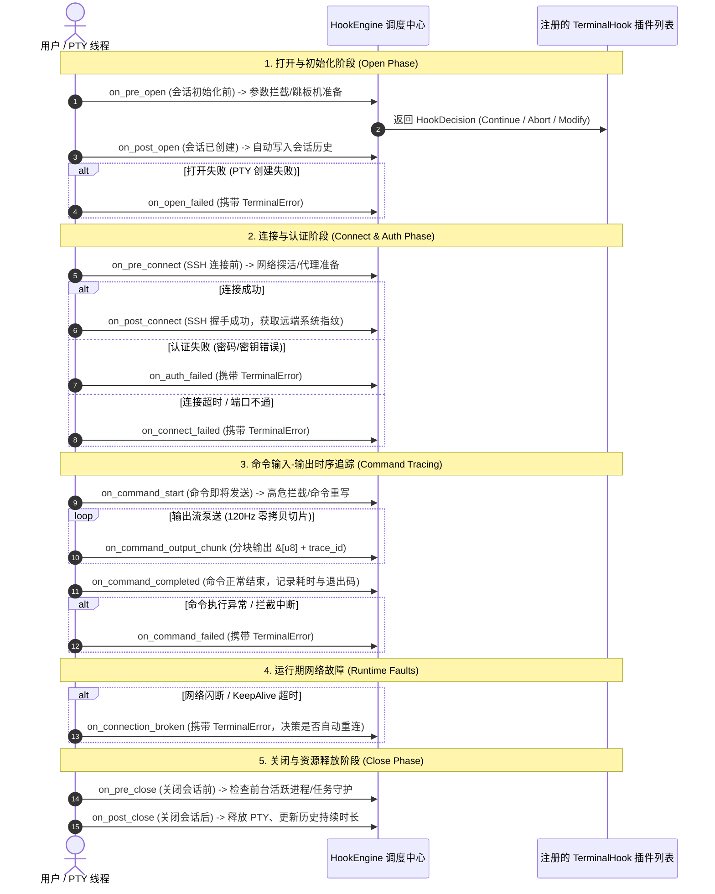

# 💻 TerminalHook 终端垂直领域 Hook 体系与设计哲学

本文档详细记录 `smagical-core` 中 **终端垂直领域 Hook 体系 (`TerminalHook`)** 的设计哲学、架构分层与**全部 16 个具体生命周期方法**的详细参数规格，供后续扩展、审计与开发同风格新 Hook 查阅。

---

## 🎯 1. 核心设计哲学 (Core Philosophy)

- **微观/会话级 (Micro / Session Level)**：聚焦在**单台机器资产、单个 PTY 会话实例与命令时序交互**；
- **高频数据面流转**：覆盖用户每敲一次命令、每次输出 Chunk 字节切片、每次 SSH 连接握手等高频事件；
- **核心使命**：
  1. 会话全生命周期管控（打开、连接、断开、清理）；
  2. 高危命令前置拦截与参数重写；
  3. 全链路输入-输出时序追踪（带 `trace_id` 与 `seq_id`）；
  4. 强类型异常捕获与容错降级（`TerminalError`）；
  5. 自动会话历史持久化（`HistoryTrackingHook`）。

---

## 🗺️ 2. 全生命周期时序流转图



---

## 📋 3. 全部 16 个具体 Hook 方法规格与参数详解

### 基础元数据方法
| 方法名 | 签名 | 说明 |
| :--- | :--- | :--- |
| **`name`** | `fn name(&self) -> &'static str` | 插件全局唯一标识字符串 (如 `"dangerous_command_guard"`)。 |
| **`priority`** | `fn priority(&self) -> i32` | 插件优先级 (默认 `0`，数值越大越先执行；安全拦截插件推荐设为 `100`)。 |

---

### 阶段一：打开与初始化 (Open Phase)
| 方法名 | 完整方法签名 | 入参说明 | 返回值与控制流 | 典型应用场景 |
| :--- | :--- | :--- | :---: | :--- |
| **`on_pre_open`** | `fn on_pre_open(&self, ctx: &mut SessionContext) -> HookDecision` | • `ctx`: 可变的会话运行时上下文 (包含 `session_id`, `pane_id`, `host`) | `HookDecision`<br>(`Continue` / `Abort` / `Modify`) | 会话打开前进行权限校验、修改端口、动态建立前置跳板机。 |
| **`on_post_open`** | `fn on_post_open(&self, ctx: &SessionContext)` | • `ctx`: 只读会话运行时上下文 | 无 | 会话已打开，自动由 `HistoryTrackingHook` 写入最新连接历史。 |
| **`on_open_failed`** | `fn on_open_failed(&self, ctx: &SessionContext, err: &TerminalError) -> HookDecision` | • `ctx`: 会话上下文<br>• `err`: 强类型异常 (如 `PtySpawnFailed`) | `HookDecision` | 本地 PTY 启动失败或系统资源耗尽时的降级恢复与告警。 |

---

### 阶段二：连接与认证 (Connect & Auth Phase)
| 方法名 | 完整方法签名 | 入参说明 | 返回值与控制流 | 典型应用场景 |
| :--- | :--- | :--- | :---: | :--- |
| **`on_pre_connect`** | `fn on_pre_connect(&self, ctx: &SessionContext) -> HookDecision` | • `ctx`: 会话上下文 | `HookDecision` | SSH 建立物理 TCP 连接前，前置探测目标主机 22 端口是否存活。 |
| **`on_post_connect`** | `fn on_post_connect(&self, ctx: &SessionContext)` | • `ctx`: 会话上下文 | 无 | SSH 握手成功，已获取远端系统指纹与 HostKey，记录连接审计。 |
| **`on_auth_failed`** | `fn on_auth_failed(&self, ctx: &SessionContext, err: &TerminalError) -> HookDecision` | • `ctx`: 会话上下文<br>• `err`: 强类型异常 (`AuthFailed`) | `HookDecision` | 密码错误、私钥被拒绝、2FA 超时，自动标记历史状态为认证失败。 |
| **`on_connect_failed`**| `fn on_connect_failed(&self, ctx: &SessionContext, err: &TerminalError) -> HookDecision` | • `ctx`: 会话上下文<br>• `err`: 强类型异常 (`ConnectionTimeout`) | `HookDecision` | 目标主机不可达或握手超时，自动触发网络诊断提示。 |

---

### 阶段三：命令输入-输出时序交互 (Command Tracing Phase)
| 方法名 | 完整方法签名 | 入参说明 | 返回值与控制流 | 典型应用场景 |
| :--- | :--- | :--- | :---: | :--- |
| **`on_command_start`** | `fn on_command_start(&self, frame: &CommandInteractionFrame) -> HookDecision<Vec<u8>>` | • `frame`: 包含 `trace_id`, `seq_id`, `raw_command`, `host` (带 `is_production` 标识) | `HookDecision<Vec<u8>>`<br>(支持 `Modify(new_bytes)` 命令重写) | **高危指令拦截守卫**：检测到生产机执行 `rm -rf /` 时直接 `Abort` 拦截；或进行快捷宏命令替换。 |
| **`on_command_output_chunk`** | `fn on_command_output_chunk(&self, trace_id: &str, host: &HostMetadata, chunk: &[u8])` | • `trace_id`: 链路追踪号<br>• `host`: 目标机器元数据<br>• `chunk`: **零拷贝输出字节切片** | 无 (极致性能) | 实时会话录屏 (asciinema)、敏感关键字触发器、动态日志流输出。 |
| **`on_command_completed`** | `fn on_command_completed(&self, frame: &CommandInteractionFrame)` | • `frame`: 包含耗时 `duration_ms`、首字延迟 `ttfb_ms`、退出码 `exit_code` | 无 | 命令执行完成，记录结构化运维审计日志，交付 AI 运维助手分析。 |
| **`on_command_failed`** | `fn on_command_failed(&self, frame: &CommandInteractionFrame, err: &TerminalError)` | • `frame`: 时序帧<br>• `err`: 异常原因 (`HighRiskCommandBlocked` 等) | 无 | 记录被拦截或执行中断的高危告警日志。 |

---

### 阶段四：运行期网络波动与故障 (Runtime Faults)
| 方法名 | 完整方法签名 | 入参说明 | 返回值与控制流 | 典型应用场景 |
| :--- | :--- | :--- | :---: | :--- |
| **`on_connection_broken`** | `fn on_connection_broken(&self, ctx: &SessionContext, err: &TerminalError) -> HookDecision` | • `ctx`: 会话上下文<br>• `err`: 强类型异常 (`NetworkBroken` / `KeepAliveTimeout`) | `HookDecision` | 网络闪断或心跳超时，决策是否触发指数退避自动重连。 |

---

### 阶段五：关闭与清理 (Close Phase)
| 方法名 | 完整方法签名 | 入参说明 | 返回值与控制流 | 典型应用场景 |
| :--- | :--- | :--- | :---: | :--- |
| **`on_pre_close`** | `fn on_pre_close(&self, ctx: &SessionContext) -> HookDecision` | • `ctx`: 会话上下文 | `HookDecision` | 关闭 Tab 前检查远端是否有前台正在跑的未完成任务 (如 `top`, `vim`, 编译任务)，弹出二次确认。 |
| **`on_post_close`** | `fn on_post_close(&self, ctx: &SessionContext)` | • `ctx`: 会话上下文 | 无 | 会话彻底关闭，自动由 `HistoryTrackingHook` 计算会话持续秒数并标记终态，释放 PTY 句柄。 |

---

## 📦 4. 核心数据模型定义 (Types & Structures)

```rust
/// 机器资产全量元数据
pub struct HostMetadata {
    pub host_id: String,                  // 主机唯一 ID (如 "host-prod-01")
    pub host_name: String,                // 展示名称 (如 "生产Web节点-01")
    pub group_path: String,               // 所在分组树路径 (如 "生产环境 / 核心组")
    pub tags: Vec<String>,                // 标签列表 (如 ["prod", "web"])
    pub is_production: bool,              // 生产机高危标识 (用于强化拦截)
    pub address: String,                  // IP / 域名 (如 "10.0.0.8")
    pub port: u16,                        // 端口 (如 22)
    pub username: String,                 // 登录用户名 (如 "root")
    pub os_distro: Option<String>,        // 操作系统发行版 (如 "Ubuntu 22.04 LTS")
    pub host_key_fingerprint: Option<String>, // SSH 服务端公钥指纹
}

/// 会话运行时上下文
pub struct SessionContext {
    pub session_id: String,               // 会话唯一 ID (如 "sess-1")
    pub pane_id: String,                  // 所在分屏窗格 ID (如 "pane-1")
    pub host: Arc<HostMetadata>,          // 关联的机器全量元数据
    pub created_at: u64,                  // 创建时间戳
}

/// 命令-输出时序交互帧
pub struct CommandInteractionFrame {
    pub trace_id: String,                 // 全链路唯一追踪 ID (如 "tr-a1b2c3d4")
    pub seq_id: u64,                      // 单会话命令自增序号 (1, 2, 3...)
    pub host: Arc<HostMetadata>,          // 目标机器信息
    pub raw_command: String,              // 原始命令文本
    pub status: FrameStatus,              // Running / Success / Failed / Interrupted
    pub started_at: u64,                  // 开始时间戳
    pub duration_ms: Option<u64>,         // 执行总耗时
    pub ttfb_ms: Option<u64>,             // 首字节响应延迟 (TTFB)
    pub exit_code: Option<i32>,           // 进程退出码
}
```

---

## 🛠️ 5. 实战扩展示例：编写同风格高危命令拦截插件

```rust
use std::sync::Arc;
use smagical_core::{TerminalHook, CommandInteractionFrame, HookDecision};

/// 示例：高危指令与删库拦截插件
pub struct StrictDangerousCommandGuard;

impl TerminalHook for StrictDangerousCommandGuard {
    fn name(&self) -> &'static str {
        "strict_dangerous_command_guard"
    }

    // 设置最高安全拦截优先级
    fn priority(&self) -> i32 {
        100
    }

    // 拦截命令
    fn on_command_start(&self, frame: &CommandInteractionFrame) -> HookDecision<Vec<u8>> {
        let cmd = frame.raw_command.trim();

        // 规则 1：生产环境严禁 rm -rf / 或 mkfs
        if frame.host.is_production && (cmd.contains("rm -rf /") || cmd.contains("mkfs")) {
            return HookDecision::Abort {
                reason: format!("⚠️ 高危拦截：生产机 [{}] 严禁执行危险删库命令 [{}]！", frame.host.host_name, cmd),
            };
        }

        // 规则 2：自动将 ll 宏替换为 ls -la
        if cmd == "ll" {
            return HookDecision::Modify(b"ls -la\n".to_vec());
        }

        HookDecision::Continue
    }
}
```
