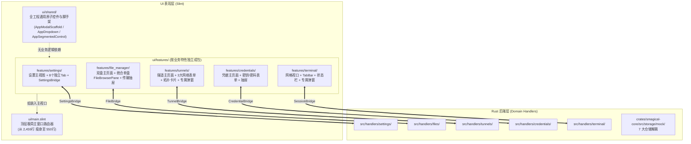

# 🏗️ 特性内聚与组件模块化重构全景指南 (Architecture Refactor Guide)

本文档是 `smalux-ssh` 整个桌面端 UI 系统与 Rust 交互层进行**工业级模块化、组件化、统一化与去臃肿解耦**的权威架构规范与落地指导手册。

---

## 一、重构背景与架构挑战

在客户端迭代演进过程中，全工程体量达到了 144 个源文件、60,888 行代码，暴露出三大典型的架构瓶颈：

1. **巨石文件堆积 (Monolithic Components)**：
   - `settings_view.slint` 达 5,708 行，包含 12 个分类和 16 个局部手写小组件；
   - `tunnels_view.slint` 达 3,012 行，混合了端口转发、跳板机、代理及弹窗；
   - `file_explorer_view.slint` 达 2,581 行，本地盘与远程盘逻辑克隆重复高达 90%；
   - `main.slint` 达 2,459 行，在 `AppWindow` 上承载了 **314 个属性与 226 个回调**。
2. **属性穿透爆炸 (Props Drilling Hell)**：
   - 为将状态传给深层 Tab，`main.slint` 仅仅是向设置中心转发参数就消耗了 208 行样板代码；
3. **霰弹式分散 (Shotgun Surgery)**：
   - 修改一个业务（如网络隧道），需要横跨 `views/`、`left_drawers/`、`right_drawers/`、`components/`、`src/handlers/` 等 8 个分散目录。

---

## 二、三位一体核心架构解决方案

为从根本上彻底解决上述问题，本工程确立**“领域桥接总线 + 4 级原子设计系统 + 特性优先物理聚合”**三大支柱架构：

### 1. 支柱一：Slint 领域桥接单例 (`Domain Bridge`) —— 终结属性穿透
- 每个独立特性包定义 `export global XxxBridge`；
- 子 Tab 与表单直接通过 `XxxBridge.property` 读写，彻底省去父子层层传递；
- `AppWindow` 属性从 314 锐减至 40，回调从 226 锐减至 18；
- Rust Handler 直接调用 `window.global::<XxxBridge>()`，与主窗口解耦。

### 2. 支柱二：4 级响应式原子设计系统 (Atomic Design System)
- **Tier 0: Design Tokens (`themes/app-theme.slint`)**：单一真实数据源；
- **Tier 1: Atomic Controls (`ui/shared/base/`)**：
  - `AppButton`, `AppIconButton`, `AppFormInput`, `AppSwitch`, `AppBadge`, `AppStatusDot`；
  - **新增补齐**：`AppDropdown`（带滚动条自适应下拉框）、`AppSegmentedControl`（动态模型分段胶囊）；
- **Tier 2: Composite Scaffolds (`ui/shared/scaffolds/`)**：
  - **`AppModalScaffold`**：统管暗黑遮罩、ESC 退出、防穿透点击、居中卡片、标题栏与操作底栏，直接消灭全仓 16 处手写弹窗；
  - **`AppMasterDetailScaffold`**：规范左侧列表 + 右侧详情自适应布局；
  - **`AppFormRow`**：规范 `Label (定宽栅格) + 控件插槽 + 辅助提示` 表单行；
- **Tier 3: Feedback (`ui/shared/feedback/`)**：
  - `ToastContainer`, `MessageDialog`, `ContextMenuContainer`。

### 3. 支柱三：特性优先高内聚物理目录 (Feature-First Colocation)
- **通用共享资产归入 `ui/shared/`**：严禁含有任何具体业务逻辑；
- **各业务特性全面“归家” (`ui/features/<module>/`)**：
  - 将过去散落在各目录的视图、抽屉、专属弹窗、表单、桥接统一收敛在专有特性包内；
  - Rust 端 `src/handlers/<module>/` 形成 1:1 镜像结构。

---

## 三、四大专项巨石单点爆破实施规范

### 1. ⚙️ 偏好设置中心 (`settings_view.slint` 5,708 行)
- **拆分方案**：
  - `features/settings/settings_view.slint`（主容器，缩减至 250 行）；
  - `features/settings/settings_bridge.slint`（单例状态总线）；
  - `features/settings/tabs/`（8 大独立分类 Tab 文件，每个 150~350 行）。

### 2. 📁 双盘文件管理器 (`file_explorer_view.slint` 2,581 行)
- **拆分方案**：
  - 提炼 `FileBrowserPane.slint`（单盘通用浏览器，~400 行）；
  - 提炼 `FileTransferDrawer.slint`（底部传输队列抽屉，~300 行）；
  - 主文件仅保留左右栏装配容器（~220 行）。

### 3. 🌐 网络隧道中心 (`tunnels_view.slint` 3,012 行)
- **拆分方案**：
  - 提炼 3 大多态表单：`TunnelForwardForm.slint`、`TunnelBastionForm.slint`、`TunnelProxyForm.slint`；
  - 提炼 `TunnelTopologyCard.slint`；
  - 迁入专属弹窗与抽屉；主文件缩减至 ~300 行。

### 4. 💾 核心存储层 (`mock_storage.rs` 2,243 行)
- **拆分方案**：
  - 拆分为 `crates/smagical-core/src/storage/mock/` 目录；
  - 独立 7 大仓储实现（hosts, groups, credentials, tunnels, snippets, history, config）；
  - 种子数据独立剥离至 `seed_data.rs`。

---

## 四、渐进落地演进路线图 (Compile Gate Assurance)

每个阶段都必须通过 `cargo check --workspace`（0 错误 0 警告）作为严格验收准则：

- **阶段 0 (脚手架基建)**：在 `ui/shared/` 健全 `AppModalScaffold`、`AppSegmentedControl`、`AppDropdown`、`AppFormRow`；
- **阶段 1 (偏好设置中心重构)**：构建 `SettingsBridge`，按 8 大 Tab 分拆 `settings_view`，精简 `main.slint`；
- **阶段 2 (双盘文件管理器归一)**：提炼 `FileBrowserPane`，双盘复用，传输抽屉解耦；
- **阶段 3 (网络隧道与安全凭据拆解)**：多态表单提取，专属弹窗收拢归位，接入统一弹窗脚手架；
- **阶段 4 (终端视口与顶层路由收敛)**：精简 `main.slint` 成为纯粹的路由器；
- **阶段 5 (Rust 领域服务与存储治理)**：拆解 `handlers/*.rs` 与 `mock_storage.rs`。
